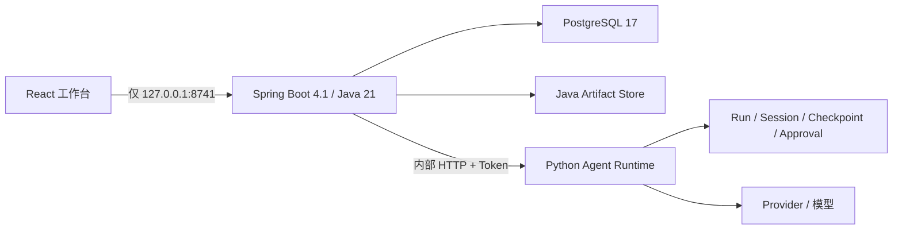

# 采价台 · 采购询价与供应商比价

采价台是本地、自托管的采购决策工作台。采购员提交采购目标和多家 XLSX/文本型 PDF 报价，Python Agent 负责自然语言需求结构化、受限文档解析和受治理 Runtime；Java 负责采购业务状态、确定性比价、审批、审计与执行草稿。

浏览器唯一入口是 [http://127.0.0.1:8741](http://127.0.0.1:8741)。


## 冻结证据

| 指标 | 当前结果 |
|---|---:|
| 原始字段抽取 | 617/620（99.52%） |
| 物料身份与规格匹配 | 31/31 |
| 到货成本计算 | 31/31 |
| 硬约束漏检 | 0/17 |
| 不合格错误入选 | 0 |

冻结数据是合成证据，不外推未知供应商版式或真实企业提效。完整脱敏证据见 [docs/evidence](docs/evidence/README.md)。

## 架构



- Java 是采购任务、附件、报价、人工修正、Agent 绑定、比价快照、待决审批、正式决定、业务审计和业务 Artifact 的唯一真源。
- Python 只拥有受限文档解析、需求抽取、Provider 调用、Run、Session、Checkpoint、Approval、工具治理、Runtime Artifact 和抽取评测。
- PostgreSQL Schema 只由 Flyway 创建；Hibernate 使用 `ddl-auto=validate`。金额使用 `numeric`/`BigDecimal`，时间使用 `timestamptz`/`Instant`。
- Python 在 Compose 中以 `internal-only` 运行，端口不映射到宿主机；除健康检查外的接口均校验 `X-Agent-Internal-Token`。
- 历史 SQLite 采购表只保留为归档兼容证据，不接入当前业务，也不会自动导入 PostgreSQL。Python Runtime 与 PostgreSQL 使用全新、独立的数据卷。

详细设计见 [架构文档](docs/architecture.md)，安全边界见 [威胁模型](docs/threat-model.md)。

## 采购闭环

- V1 包装需求支持数量、宽长厚、材质、颜色、印刷、公差、交期、发票、预算和固定汇率。
- V2 非包装需求支持文本、数值、布尔动态规格，以及单位换算、精确/公差/范围/上下界和硬性/偏好优先级。
- 首次对话使用 `multipart/form-data` 的 `message` 与重复 `files` part；单份报价上传使用 `file` part。
- 原件进入 Java SHA-256 两级分片 Artifact Store。低置信度、缺失或冲突字段必须人工复核后才能比价。
- Java 先检查物料、规格、MOQ、交期、发票、预算、有效期，再归一化计价单位、税费、运费和汇率并按到货总成本稳定排序。
- 规则推荐不会自动形成决定。批准或流标必须经 Harness 产生的一次性 Approval，并逐项绑定 Run、工具、任务版本、快照、输入哈希、决定、报价和备注哈希。
- 需求或报价修正会原子失效当前快照与待决审批；迟到审批返回 stale approval，旧证据继续保留。
- 批准后生成采购订单与供应商确认邮件两个 Java 业务 Artifact；流标不生成执行草稿，可复制需求并选择是否复制报价重新询价。
- Java 采购报告在 Python 不可用时仍返回 HTTP 200；实时 Runtime 代理在 Python 不可用时返回结构化 503。

## 快速开始

要求 Docker Desktop 可用。首次启动：

```powershell
Copy-Item .env.example .env
# 在 .env 中设置随机 AGENT_INTERNAL_TOKEN 和 POSTGRES_PASSWORD
docker compose up -d --build
docker compose ps
```

当前 Windows 中文路径下 Docker BuildKit 可能拒绝构建上下文；遇到 header non-printable ASCII 错误时：

```powershell
$env:DOCKER_BUILDKIT='0'
docker build -f Dockerfile.agent -t caijiatai-agent:0.4.0 .
docker build -f procurement-service/Dockerfile -t caijiatai-procurement:0.4.0 .
docker compose up -d --no-build
```

健康检查：

```powershell
Invoke-RestMethod http://127.0.0.1:8741/api/health
docker compose ps
```

只有 `127.0.0.1:8741` 应出现在宿主端口映射中。PostgreSQL 和 Python Agent 只在 Compose 网络内可达。Java readiness 依赖 PostgreSQL；Agent 状态作为可降级能力单独报告。

## 模型配置

右上角“API / 模型配置”通过 Java 白名单代理配置 Python Agent。API Key 只保存在 Python Runtime 数据目录，不进入 PostgreSQL、Run、日志、Artifact 或 GET 响应。离线演示使用 `procurement_fake`；真实 Provider 的 429 优先遵守 `Retry-After`，否则执行有界退避。

当前真实模型脱敏记录见 [real-model-acceptance.md](docs/evidence/real-model-acceptance.md)。未配置价格时费用只能标记为未计价，不能解释为免费。

## 演示数据与评测

```powershell
uv sync --all-groups --frozen
uv run python scripts/generate_procurement_demo.py --output output/procurement-demo
uv run python scripts/generate_procurement_scenarios.py
uv run python scripts/evaluate_procurement.py run --output output/procurement-evaluation-v3
uv run python scripts/evaluate_procurement.py verify --input output/procurement-evaluation-v3/raw-results.json
```

`output/procurement-demo/` 包含 31 份冻结报价；`output/procurement-scenarios/` 包含标签、纸箱和 BOPP 封箱胶带三套独立场景。真人辅助实验始终连接 Java 入口：

```powershell
docker compose up -d
uv run python scripts/evaluate_procurement.py human-trial --mode assisted --observer 匿名测试员-01 --base-url http://127.0.0.1:8741
```

## API 与契约

采购公开路径保持 `/api/procurement/**`。主要接口：

```text
POST /api/procurement/conversations
GET  /api/procurement/requests
POST /api/procurement/requests
GET  /api/procurement/requests/{id}
PUT  /api/procurement/requests/{id}/requirement
POST /api/procurement/requests/{id}/quotes
POST /api/procurement/requests/{id}/quotes/{quote_id}/corrections
POST /api/procurement/requests/{id}/analyze
POST /api/procurement/requests/{id}/decision
POST /api/procurement/requests/{id}/reopen
GET  /api/procurement/requests/{id}/report
```

`contracts/` 保存 Java/Python OpenAPI、Decimal 规范化、规范 JSON 字节与 SHA-256、31 份完整比价黄金契约。API Schema 为 11，Java、Python 和 Web 版本均为 0.4.0。

## 验证

```powershell
uv run ruff check .
uv run pytest --cov=agentharness --cov-report=term --cov-fail-under=80 -q
uv build

Set-Location procurement-service
.\mvnw.cmd test
Set-Location ..

Set-Location web
npm test
npm run lint
npm run build
Set-Location ..
uv run python scripts/check_web_build_determinism.py
```

完整 Compose、故障和浏览器验收顺序见 [发布检查清单](docs/release-checklist.md)，现场演示见 [演示手册](docs/demo-playbook.md)。

## License

[MIT](LICENSE)
