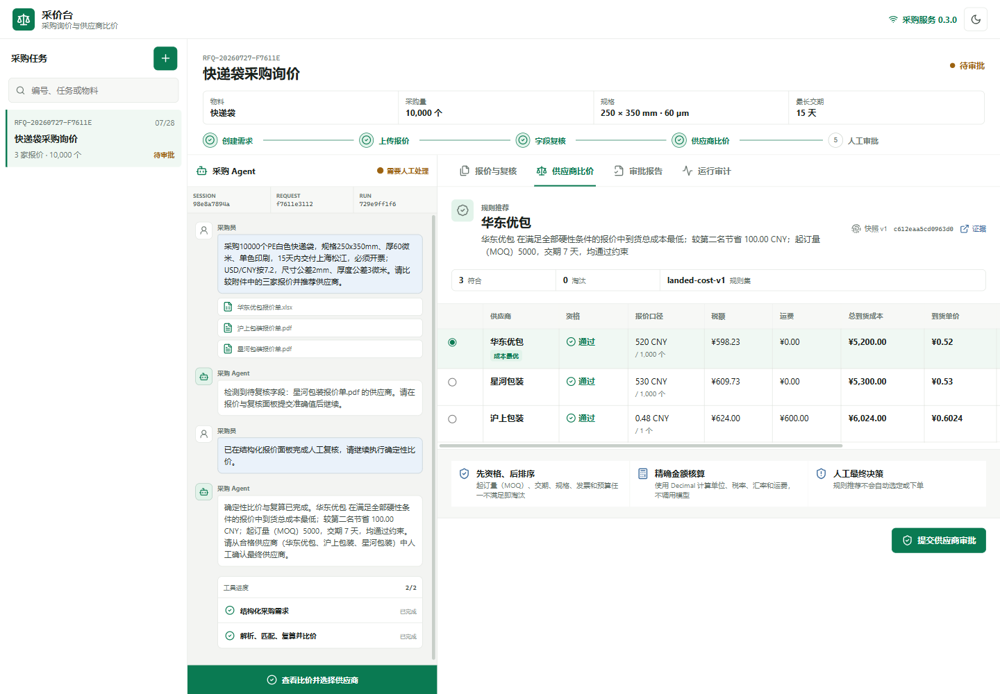
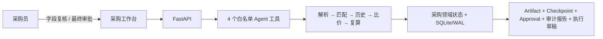

# 采价台 · 采购询价与供应商比价

采价台是面向制造/包装企业采购专员与审批人的本地、自托管采购决策工作台，以电商包装耗材为首个验证品类。真实业务中，供应商报价来自不同格式文件，字段口径、供应商名称、税费、运费和交期经常不一致；采购不能只看报价，而需要一份可解释、可复核、可审计的供应商选择依据。用户从 Web 提交采购目标和多家 XLSX/文本型 PDF 报价，AI 负责需求结构化与受治理编排，采购员复核关键事实，再由确定性规则完成资格筛选、到货成本归一化、供应商比较、人工审批，并生成采购订单和供应商确认邮件草稿。



当前仓库可独立复算的冻结证据：

| 指标 | 当前结果 |
|---|---:|
| 原始字段抽取 | 617/620（99.52%） |
| 物料身份与规格匹配 | 31/31 |
| 到货成本计算 | 31/31 |
| 硬约束漏检 / 不合格错误入选 | 0/17 / 0 |



底层保留 Agent Harness 的 Checkpoint、Approval、Artifact、事件和进程恢复能力。采购业务状态由独立领域模型拥有；Agent Runtime 只负责自然语言需求、受治理工具编排和说明，金额、资格与最终决定不由模型生成。完整脱敏证据见 [`docs/evidence/`](docs/evidence/README.md)。

## 采购闭环

- 创建快递袋等包装耗材需求，记录数量、规格、公差、交期、发票、币种和固定汇率口径；包装任务继续使用 V1 规则。
- 非包装物料使用 V2 动态规格，规格可按业务定义文本、数值或布尔类型、单位、匹配方式和硬性/偏好优先级，数量支持 Decimal，不再套用宽/长/厚度上限。
- 导入多家 `.xlsx` 与文本型 `.pdf` 报价；原件进入 SHA-256 内容寻址 Artifact Store。
- 查看供应商、规格、单价口径、税率、运费、MOQ、交期等字段的原文定位、摘录和置信度。
- 低于 80% 置信度或缺失的必需字段强制进入人工复核，修正前不能比价。
- 使用 Python `Decimal` 统一每个/每千个、含税/未税、币种和运费，计算总到货成本与到货单价。
- 先淘汰违反 MOQ、交期、规格、发票、预算或有效期硬条件的报价，再按总到货成本排序。
- 规则推荐不会自动形成业务决定；采购员必须在确认框中正式选定供应商。
- 如果当前没有任何合格报价，页面只提供调整需求、补充报价、重新比价或填写原因后流标；流标不生成订单/邮件草稿，可从审计报告复制需求并选择是否复制报价后重新询价。
- 采购需求本身也支持人工确认和修正，保存前后值、操作人和时间。
- 采购报告固化原件哈希、修正记录、比价输入哈希、规则版本、供应商历史证据、审批人和完整时间线。
- 审批后生成可人工编辑的采购订单草稿与供应商确认邮件草稿，两个 Artifact 均可追溯到已批准报价。

每次比价都会关联一个 Harness Run、终态 Checkpoint、待确认 Approval、原始报价与比价快照 Artifacts，以及可复现的运行证据报告。刷新或重启进程后，这些关系从 SQLite 恢复。

## 快速开始

要求 Python 3.11+、[uv](https://github.com/astral-sh/uv) 和 Node.js 20+。

```powershell
uv sync --all-groups
Set-Location web
npm ci
npm run build
Set-Location ..
uv run agentharness --workspace .
```

默认打开 [http://127.0.0.1:8741](http://127.0.0.1:8741)。不希望自动打开浏览器时：

```powershell
uv run agentharness --workspace . --no-open
```

采购的确定性解析、成本计算、资格检查与审批不要求模型密钥。配置 `OPENAI_API_KEY` 后，保留的 Agent Runtime 可用于非结构化字段抽取、规格候选匹配、缺失信息澄清和推荐说明；金额、资格、排序输入和最终决策数据不得由模型生成。

### 采购模型配置

采购 Agent 默认使用 `openai` OpenAI 兼容 Provider。首次启动可从右上角“API / 模型配置”填写模型、Base URL、API Key、价格和单 Run 费用上限；配置会保存到本地服务数据目录的 `procurement-model-config.json`，重启后自动恢复。API Key 不进入数据库、Run、日志、Artifact 或前端 GET 响应。

需要完全离线演示时，可在设置页切换为 `procurement_fake`，或显式设置：

```text
AGENTHARNESS_PROCUREMENT_PROVIDER=procurement_fake
AGENTHARNESS_PROCUREMENT_MODEL=<已授权模型>
AGENTHARNESS_PROCUREMENT_REASONING_EFFORT=max
AGENTHARNESS_PROCUREMENT_INPUT_PER_MILLION_USD=<输入价格>
AGENTHARNESS_PROCUREMENT_OUTPUT_PER_MILLION_USD=<输出价格>
AGENTHARNESS_PROCUREMENT_CACHED_INPUT_PER_MILLION_USD=<缓存输入价格，可省略并按输入价格计算>
AGENTHARNESS_PROCUREMENT_MAX_COST_USD=<单 Run 费用上限>
AGENTHARNESS_PROCUREMENT_MAX_TOKENS=100000
AGENTHARNESS_PROCUREMENT_MAX_STEPS=12
AGENTHARNESS_PROCUREMENT_MAX_WALL_TIME_S=180
```

价格单位均为 USD/百万 Token，费用上限单位为 USD。未填写价格时服务仍可启动，但成本估算为 0；建议在真实调用前补齐价格和费用上限。建议使用新的目录和端口，避免与冻结评测或真人盲测数据混合：

```powershell
uv run agentharness --workspace . --data-dir output/procurement-live-acceptance --port 8767 --no-open
```

真实模式应在独立数据目录只运行预注册场景，并通过 `GET /api/runs/{run_id}/report` 核对模型、工具、Checkpoint、Verification、Approval、Token、耗时和估算费用。上游 429 优先遵守 `Retry-After`，否则执行有界退避。当前真实模型闭环记录见 [`docs/evidence/real-model-acceptance.md`](docs/evidence/real-model-acceptance.md)：正常场景使用 `gpt-5.6-luna` 完成 5 个模型回合、3 次成功工具调用和一次人工审批；异常输入没有调用采购工具，也没有生成比价快照。测试目录未配置价格，因此估算费用为 0，不代表真实调用免费。

本项目交付范围是桌面浏览器中的采购工作台，不包含 Docker 编排、手机端或移动端代码。采购领域不引入泛聊天、多 Agent、LangGraph、Kafka、Redis 或 ERP 深度集成。

## 报价安全边界

- 只接受 `.xlsx` 和文本型 `.pdf`，单文件最大 5 MB。
- 每个采购任务最多 50 份报价；对话首次批量上传总计最多 20 MB。
- XLSX 最多 5 个工作表、500 行、40 列，并限制 ZIP 条目、解压总量、单条目大小和异常压缩比。
- PDF 最多 20 页、20 万提取字符；加密文件、空文本文件和扫描件会被拒绝。
- 原件哈希、解析器版本、处理耗时、字段证据和每次人工修正均持久化。
- OCR、第三方价格爬取、自动询价邮件、自动下单、自动付款和 ERP 深度集成不在当前范围内。

默认只绑定 `127.0.0.1`。非回环绑定必须显式使用 `--allow-remote-execution`，并在前面部署认证代理；未显式授权时仅保留健康检查 API。路径 sandbox 不是 OS 隔离，完整边界见 [威胁模型](docs/threat-model.md)。

## 演示与评测

冻结真值集包含 31 份合成 XLSX/PDF 报价与 6 种独立版式，覆盖每个/每百个/每千个计价、税率与含税口径、运费另计、CNY/USD/EUR、MOQ 与交期边界、材质、颜色、印刷色数、尺寸公差、预算、发票、有效期和字段缺失等 22 类异常或边界组合。

生成可重复上传的 31 份演示报价：

```powershell
uv run python scripts/generate_procurement_demo.py --output output/procurement-demo
```

### 三套独立采购演示单

如需展示不同业务物料，可生成三套不修改冻结真值集的独立采购任务：

```powershell
uv run python scripts/generate_procurement_scenarios.py
```

文件集中保存在 `output/procurement-scenarios/`，每套包含 `request.json` 和 3 份不同版式或商务条件的报价：

| 目录 | 场景 | 预期推荐 |
|---|---|---|
| `01-仓储热敏标签` | 华东仓热敏不干胶标签 | 苏州标联 |
| `02-出口瓦楞纸箱` | 苏州工厂出口瓦楞纸箱 | 浙江箱业 |
| `03-透明封箱胶带` | 上海仓 BOPP 透明封箱胶带 | 嘉兴胶粘 |

这些是合成演示数据，不参与 31 份冻结评测；每套均可直接上传到 Web 工作台验证规格、币种、运费、MOQ、交期和发票约束。

生成确定性基线、辅助方案、原始逐字段结果、CSV 指标和中文验证报告：

```powershell
uv run python scripts/evaluate_procurement.py run --output output/procurement-evaluation-v3
uv run python scripts/evaluate_procurement.py verify --input output/procurement-evaluation-v3/raw-results.json
```

结果写入 `output/procurement-evaluation-v3/`。`raw-results.json` 保存逐字段、逐报价与版式结果，`verify` 从原始结果重新计算全部质量指标、样本数、版式覆盖和验收结论，不改写文件。真值 SHA-256 固定为 `63647f520bff1ab20e9215cc65e1b246a6f27fcf88cdb226fe7eae72fd6c1ffb`；公开最小汇总由测试与同一结果自动对照。

真人实验脚本使用从冻结集预注册的 6 份代表性报价，每种版式恰好一份，并覆盖外币、单位、运费、MOQ、交期、规格、发票和字段缺失；31 份全量准确率只由离线评测得出，不从 6 份盲测外推。当前证据不外推未知版式的真实准确率，也不报告未经设计的提效比例。重新实验时必须先做纯人工、再做产品辅助：

```powershell
uv run python scripts/evaluate_procurement.py human-trial --mode manual --observer 匿名测试员-01
```

纯人工记录保存后，使用一个从未启动过的新数据目录开启独立 Fake Provider 采价台。该命令会自动打开浏览器；若目录中已有采购任务，后续盲测预检会拒绝继续：

```powershell
uv run agentharness --workspace . --data-dir output/procurement-human-trial-data --port 8766
```

在另一个终端启动产品辅助计时。完成浏览器审批后，脚本会从服务端事实自动读取最终报价，并校验原件哈希、Run、工具链、Checkpoint、审批及两类报告指纹，不接受测试员手工补写供应商选择：

```powershell
uv run python scripts/evaluate_procurement.py human-trial --mode assisted --observer 匿名测试员-01 --base-url http://127.0.0.1:8766
```

产品辅助模式在新建采购对话中选择 `output/procurement-human-trial-input/` 内的全部 6 份报价。采购目标应按该目录的 `request.json` 原样转述，并明确“白色 PE、单色印刷”等身份规格。该说明只包含采购需求，不暴露报价异常、金额真值或推荐答案。

任务处理计时在最终选择或采购审批完成时停止，自动取证和后续实验备注不计入活跃时间。演示清单不暴露异常类型、金额真值或推荐结果。只有盲测确认、测试员、真值、全部输入文件指纹和采价台自动审批证据一致的两份记录才能合并；纯人工错误由真值复算，辅助过程错误保持为测试员自报口径，不据此虚构错误降幅。

完成浏览器审批并重启服务后，可将采购状态、报价原件、修正、比价、审批、报告与 Checkpoint 导出为自校验闭环证据：

```powershell
uv run python scripts/evaluate_procurement.py capture-workflow --base-url http://127.0.0.1:8741 --reference RFQ-YYYYMMDD-XXXXXX
uv run python scripts/evaluate_procurement.py run --manual-trial output/procurement-evaluation/manual-trial.json --assisted-trial output/procurement-evaluation/assisted-trial.json --workflow-evidence output/procurement-evaluation/workflow-evidence.json
```

真人对照完成前，报告明确保留“待实测”，不会生成提效比例。

评测接口 `GET /api/procurement/evaluation` 输出：

- 字段抽取准确率；
- 物料/规格匹配准确率；
- 成本计算准确率；
- 硬约束漏检率；
- 推荐准确率与推荐稳定率；
- 总耗时和单报价平均耗时；
- 模型调用、tokens 与估算费用。

真值文件为 `src/agentharness/procurement/eval_truth.json`，响应包含其 SHA-256。

## 架构边界

| 模块 | 责任 |
|---|---|
| `procurement/parsing.py` | 受限 XLSX/PDF 解析、字段证据、类型归一化和低置信度路由 |
| `procurement/costing.py` | Decimal 成本计算、硬约束、排序和确定性说明 |
| `procurement/service.py` | 采购用例、状态推进、不可变快照、人工审批和 Runtime 关联 |
| `storage/procurement.py` | 采购需求、报价、快照、决策和追加式审计事件 |
| `api/procurement.py` | 严格校验的采购 Web API |
| `web/src/procurement/` | 采购任务工作台、字段校对、比价、报告和运行审计 |
| `Harness` / `RunEngine` | 原有受治理 Agent 执行、恢复、工具审批和证据能力 |

详细关系见 [架构文档](docs/architecture.md)。真实模型与异常输入的脱敏验收见 [`docs/evidence/real-model-acceptance.md`](docs/evidence/real-model-acceptance.md)。

5 分钟现场演示、Checkpoint 恢复路径、实测简历描述和面试追问见 [演示与面试手册](docs/demo-playbook.md)。最终本地与真实模型验收顺序见 [发布检查清单](docs/release-checklist.md)。

## Web API

采购主接口：

```text
GET  /api/procurement/meta
GET  /api/procurement/requests
POST /api/procurement/requests
GET  /api/procurement/requests/{id}
PUT  /api/procurement/requests/{id}/requirement
POST /api/procurement/requests/{id}/quotes
POST /api/procurement/requests/{id}/quotes/{quote_id}/corrections
POST /api/procurement/requests/{id}/analyze
POST /api/procurement/requests/{id}/decision
POST /api/procurement/requests/{id}/reopen
GET  /api/procurement/requests/{id}/report
GET  /api/procurement/evaluation
```

Harness 审计接口继续提供 `GET /api/runs/{id}/report`、`GET /api/runs/{id}/checkpoint`、审批、Artifacts、工具调用和事件查询。未列入采购白名单的写接口返回 `405`；采购需求人工确认使用上面的专用 `PUT` 接口。

## 验证

```powershell
uv run pytest --cov=agentharness --cov-report=term --cov-fail-under=80 -q
uv run ruff check src tests
uv build

Set-Location web
npm run test
npm run lint
npm run build
```

## License

[MIT](LICENSE)
