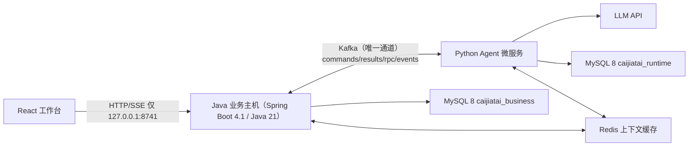

# 采价台 · 采购询价与供应商比价

采价台是本地、自托管的采购决策工作台。采购员提交采购目标和多家 XLSX/文本型 PDF 报价，Python Agent 负责自然语言需求结构化、受限文档解析和受治理 Runtime；Java 负责采购业务状态、确定性比价、审批、审计与执行草稿。

浏览器唯一入口是 [http://127.0.0.1:8741](http://127.0.0.1:8741)。


## 冻结证据

| 指标 | 当前结果 |
|---|---:|
| 原始字段抽取 | 617/620（99.52%） |
| 物料身份与规格匹配 | 31/31 |
| 到货成本计算 | 31/31 |
| 硬约束漏检 | 0/17 |
| 不合格错误入选 | 0 |

冻结数据是合成证据，不外推未知供应商版式或真实企业提效。完整脱敏证据见 [docs/evidence](docs/evidence/README.md)。

## 架构（0.5.0：Java 业务主机 + Python Agent 微服务，Kafka 唯一通道）



- Java 是采购任务、附件、报价、人工修正、比价快照、待决审批、正式决定、业务审计、业务 Artifact、SSE 事件投影的唯一真源；可脱离 Python 独立运行（`APP_AGENT_MODE=demo`）。
- Python Agent 是嵌入式微服务，只保留自然语言需求结构化、XLSX/PDF 文档解析、Provider 调用、Run/事件与运行时 MySQL；通过 Kafka 命令/结果/RPC/事件与 Java 通信。
- 业务 Schema 只由 Java Flyway 创建（V1-V7），运行时 Schema 由 Python Agent 自建；禁止交叉建表。金额使用 `DECIMAL`/`BigDecimal`，时间使用 `DATETIME(6)`/`Instant`。
- Kafka 使用 KRaft 单节点：`caijiatai.commands/results/rpc.requests/rpc.responses/events` + 各 `*.dlq`；消息带 HMAC-SHA256 签名与 `payload_sha256`，双侧幂等。
- 内部 HTTP 与 `X-Agent-Internal-Token` 已删除；Python 读取业务上下文/原件走 Kafka RPC（`get_task_context` / `get_artifact` / `list_events`）。
- 历史 SQLite/PostgreSQL 数据不迁移，仅归档；Python Runtime 与业务库使用全新数据卷。

详细设计见 [架构文档](docs/architecture.md)，安全边界见 [威胁模型](docs/threat-model.md)。

## 采购闭环

- V1 包装需求支持数量、宽长高厚（纸箱高度为必填项）、材质、颜色、印刷、公差、交期、发票、预算和固定汇率。
- V2 非包装需求支持文本、数值、布尔动态规格，以及单位换算、精确/公差/范围/上下界和硬性/偏好优先级。
- 首次对话使用 `multipart/form-data` 的 `message` 与重复 `files` part；单份报价上传使用 `file` part。
- 原件进入 Java SHA-256 两级分片 Artifact Store。低置信度、缺失或冲突字段必须人工复核后才能比价。
- Java 先检查物料、规格、MOQ、交期、发票、预算、有效期，再归一化计价单位、税费、运费和汇率并按到货总成本稳定排序。
- 规则推荐不会自动形成决定。批准或流标必须经 Harness 产生的一次性 Approval，并逐项绑定 Run、工具、任务版本、快照、输入哈希、决定、报价和备注哈希。
- 需求或报价修正会原子失效当前快照与待决审批；迟到审批返回 stale approval，旧证据继续保留。
- 批准后生成采购订单与供应商确认邮件两个 Java 业务 Artifact；流标不生成执行草稿，可复制需求并选择是否复制报价重新询价。
- Java 采购报告与已投影的 Run 审计在 Python 不可用时仍可读取；实时 `/api/runtime` 可用性检查在心跳过期时返回结构化 503。
- kafka/demo 模式下冻结评测面板由 Java 自带资源提供（`frozen-evaluation.json`，与 Python 冻结真值集同步，见 `scripts/export_frozen_evaluation.py`）。


## 快速开始

要求 Docker Desktop 可用。五服务拓扑（MySQL/Redis/Kafka/Agent/Procurement）：

```powershell
Copy-Item .env.example .env
# 在 .env 中填写独立的业务库/运行时库密码、Kafka 三个账号密码与 AGENT_INTERNAL_HMAC_KEY（均使用随机值）
docker compose build
docker compose up -d --no-build
docker compose ps
```

健康检查：

```powershell
Invoke-RestMethod http://127.0.0.1:8741/api/health
docker compose ps
```

- 只有 `127.0.0.1:8741` 映射到宿主机；MySQL/Redis/Kafka/Python Agent 只在 Compose 网络内可达。
- Java readiness 只依赖 MySQL；`agent_status` 来自 Python 每 5s 的 `heartbeat.ping`（≤15s 为 up），不可用时降级为 down 而不影响业务。
- 黄金演示：`APP_DEMO_SEED_ENABLED=true` 时 Java 启动预置 3 套合成场景（标记 synthetic），用 `APP_AGENT_MODE=demo` 可脱离 Python 走通全闭环。
- SASL/SCRAM 加固：`compose.kafka-sasl.yml`（cp-kafka）首次启动在 `kafka-storage format --add-scram` 预置 admin/java-svc/python-agent；已实测五服务 healthy、无凭据访问失败、全闭环通过。
- 本地开发（不构建镜像）：先 `docker compose up -d mysql redis` 再 `docker compose -f compose.kafka.yml up -d` 起 Kafka；
  Java 用 `mvnw spring-boot:run`，Python 用 `uv run python -m agentharness.agent_service`（Agent 会读取仓库 `.env`，
  需要 `AGENTHARNESS_DATABASE_URL` 与 `AGENT_INTERNAL_HMAC_KEY`，示例见 `.env.example`）。

### 环境变量

| 变量 | 默认/示例 |
|---|---|
| `DATABASE_URL` | `jdbc:mysql://127.0.0.1:3306/caijiatai_business?useSSL=false&allowPublicKeyRetrieval=true&serverTimezone=UTC&characterEncoding=UTF-8` |
| `PROCUREMENT_DATABASE_USER` / `PROCUREMENT_DATABASE_PASSWORD` | Java 业务 schema 专用账号与随机密码 |
| `AGENT_DATABASE_USER` / `AGENT_DATABASE_PASSWORD` | Python Runtime schema 专用账号与随机密码 |
| `AGENTHARNESS_DATABASE_URL` | Python Agent 运行时 MySQL URL（本地开发用 `mysql+pymysql://…@127.0.0.1:3306/caijiatai_runtime`，Compose 会覆盖为 compose 网络内的 `mysql` 主机） |
| `MYSQL_ROOT_PASSWORD` | 仅用于初始化数据库的随机 root 密码 |
| `KAFKA_BOOTSTRAP_SERVERS` / `AGENT_KAFKA_BOOTSTRAP_SERVERS` | `127.0.0.1:9092` |
| `AGENT_INTERNAL_HMAC_KEY` | ≥32 字节随机串（Java/Python 共享） |
| `KAFKA_ADMIN_*` / `KAFKA_JAVA_*` / `KAFKA_AGENT_*` | SASL/SCRAM 管理、Java、Python 账号与随机密码 |
| `REDIS_URL` / `SPRING_DATA_REDIS_HOST` | `redis://127.0.0.1:6379/0` / `redis` |
| `APP_PORT` / `AGENT_PORT` | `8741` / `8742` |
| `APP_AGENT_MODE` | `kafka`（默认生产形态）/ `demo`（脱离 Python 的合成闭环） |
| `APP_DEMO_SEED_ENABLED` / `APP_DEMO_SEED_ROOT` | `false` / `output/procurement-scenarios` |
| `AGENTHARNESS_PROCUREMENT_PROVIDER` | `procurement_fake`（离线演示）或 `openai` |

## 模型配置

Kafka 模式的模型配置以 `.env` / 环境变量为唯一真源，右上角“API / 模型配置”只显示当前脱敏状态。API Key 不进入 MySQL、Run、日志、Artifact 或 GET 响应。离线演示使用 `procurement_fake`；真实 Provider 的 429 优先遵守 `Retry-After`，否则执行有界退避。

当前真实模型脱敏记录见 [real-model-acceptance.md](docs/evidence/real-model-acceptance.md)。未配置价格时费用只能标记为未计价，不能解释为免费。

## 演示数据与评测

```powershell
uv sync --all-groups --frozen
uv run python scripts/generate_procurement_demo.py --output output/procurement-demo
uv run python scripts/generate_procurement_scenarios.py
uv run python scripts/evaluate_procurement.py run --output output/procurement-evaluation-v3
uv run python scripts/evaluate_procurement.py verify --input output/procurement-evaluation-v3/raw-results.json
```

`output/procurement-demo/` 包含 31 份冻结报价；`output/procurement-scenarios/` 包含标签、纸箱和 BOPP 封箱胶带三套独立场景。真人辅助实验始终连接 Java 入口：

```powershell
docker compose up -d
uv run python scripts/evaluate_procurement.py human-trial --mode assisted --observer 匿名测试员-01 --base-url http://127.0.0.1:8741
```

## API 与契约

采购公开路径保持 `/api/procurement/**`。主要接口：

```text
POST /api/procurement/conversations
GET  /api/procurement/requests
POST /api/procurement/requests
GET  /api/procurement/requests/{id}
PUT  /api/procurement/requests/{id}/requirement
POST /api/procurement/requests/{id}/quotes
POST /api/procurement/requests/{id}/quotes/{quote_id}/corrections
POST /api/procurement/requests/{id}/analyze
POST /api/procurement/requests/{id}/decision
POST /api/procurement/requests/{id}/reopen
GET  /api/procurement/requests/{id}/report
```

`contracts/` 保存 Java/Python OpenAPI、Decimal 规范化、规范 JSON 字节与 SHA-256、31 份完整比价黄金契约。API Schema 为 11，Java、Python 和 Web 版本均为 0.5.0。

## 验证

```powershell
uv run ruff check .
uv run pytest --cov=agentharness --cov-report=term --cov-fail-under=80 -q
uv build

Set-Location procurement-service
.\mvnw.cmd test
Set-Location ..

Set-Location web
npm test
npm run lint
npm run build
Set-Location ..
uv run python scripts/check_web_build_determinism.py
```

完整阶段执行顺序见 [采购工作台重构总控](docs/procurement-workbench-refactor-plan.md)；Compose、故障和浏览器验收顺序见 [发布检查清单](docs/release-checklist.md)，现场演示见 [演示手册](docs/demo-playbook.md)。

## License

[MIT](LICENSE)
