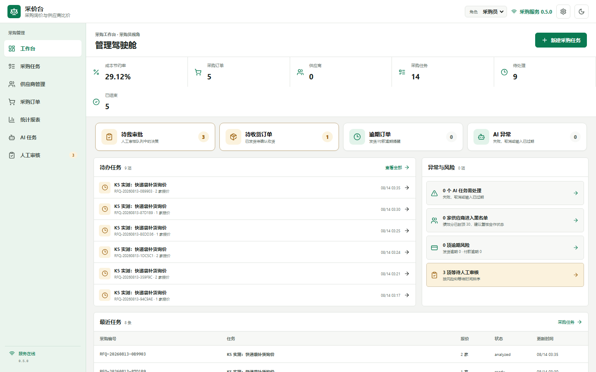
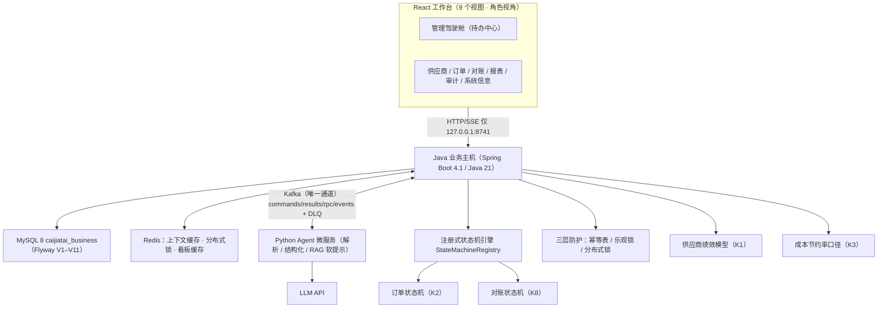
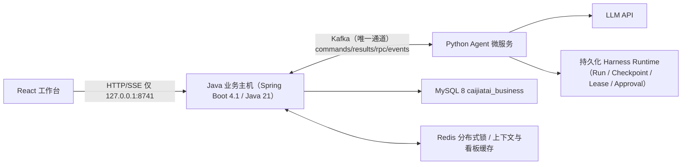

# AI 智能采购平台（原采价台）· 采购询价、比价、审批、订单与供应商管理

AI 智能采购平台是本地、自托管的采购决策工作台。采购员提交采购目标和多家 XLSX/文本型 PDF 报价，Python Agent 负责自然语言需求结构化、受限文档解析和受治理 Runtime；Java 负责采购业务状态、确定性比价、审批、订单生命周期、对账付款、供应商绩效、统计报表、审计与执行草稿。

浏览器唯一入口是 [http://127.0.0.1:8741](http://127.0.0.1:8741)。



采购任务详情（三家报价比价与人工审批入口）见 [docs/evidence/comparison.png](docs/evidence/comparison.png)。

## 冻结证据

| 指标 | 当前结果 |
|---|---:|
| 原始字段抽取 | 617/620（99.52%） |
| 物料身份与规格匹配 | 31/31 |
| 到货成本计算 | 31/31 |
| 硬约束漏检 | 0/17 |
| 不合格错误入选 | 0 |

冻结数据是合成证据，不外推未知供应商版式或真实企业提效。完整脱敏证据见 [docs/evidence](docs/evidence/README.md)。

## 面试官视角：3 分钟看懂架构与差异化

> 一句话：**Java 业务主机 + Python Agent 微服务 + Kafka 可靠消息 + 确定性比价评测**，在此基础上补齐了传统 Java 项目的高频考点（状态机引擎、分布式锁、缓存、超时调度、并发派生）。



**六大面试考点速览**（详见 [docs/resume.md](docs/resume.md) 双语言项目描述）：

1. **注册式通用状态机引擎（平台叙事）**：`platform/statemachine` 包定义状态/事件枚举 + 流转表 + 动作钩子，`StateMachineRegistry` 注册订单（PENDING_SHIPMENT→SHIPPED→RECEIVED→CLOSED）与对账（UNSETTLED→SETTLED→PAID）状态机；非法流转 409，并发由乐观锁兜底。新增业务只需注册自己的状态机——"平台可扩展"有代码证据。现有任务状态机为历史实现，不迁移（README 如实说明）。
2. **三层防护各司其职**：幂等表防**重放**（同请求重复提交返回原结果）；乐观锁防**版本覆盖**（任务修正后旧审批失效，`version` 条件更新）；Redis 分布式锁防**并发双写**（`lock:decision:{taskId}` SETNX + 请求标识 + Lua 条件释放，10s TTL，Redis 不可用自动回退无锁路径）。被问"已有幂等为什么还要锁"：三层防的是三种不同故障。
3. **惰性派生 tradeoff**：订单由已批准任务在查询时惰性派生（读接口带写副作用——反模式），权衡是**绝不触碰审批核心证据链**；`purchase_order.UNIQUE(task_id)` + `DuplicateKeyException` 幂等吞掉保证并发双请求只落一条。生产化可改为审批完成事件监听（README 注明）。
4. **供应商绩效模型（冻结口径）**：绩效分实时派生不落表——中标率得分（0–60，报价 **<3 次按 0.5 折减**防新供应商虚高）+ 活跃度（min(20, 次数×2)）+ 合作状态（20/10/0）；**黑名单强制封顶 30**；等级映射 优质/良好/一般/待观察。BigDecimal 精确到 2 位。
5. **成本节约率口径（保守）**：`(Σ预算单价×数量 − Σ批准到货总价) / Σ预算单价×数量`；预算取任务约束 `max_landed_unit_cost`（到货单价上限），**无预算任务不计入**，比例保留 4 位。被问"为什么用上限做分母"：保守口径，实际节约率不低于此值。
6. **历史报价 RAG（软提示）**：Java RPC `get_reference_prices` 聚合历史已批准订单成交价（物料名归一化匹配 + 品类兜底，p25/p75，**不足 3 条返回 null**）；Python 注入 `reference_price_interval` 可选字段与异常价格风险 flag——**只进解释文本与风险标记，不参与比价排序、不排除报价、不影响冻结评测**；硬规则化与向量库（Milvus/BGE）为后续扩展。

## 架构（0.5.0：Java 业务主机 + Python Agent 微服务，Kafka 唯一通道）



- Java 是采购任务、附件、报价、人工修正、比价快照、待决审批、正式决定、供应商档案、采购订单、对账付款、统计报表、业务审计、业务 Artifact、SSE 事件投影的唯一真源；可脱离 Python 独立运行（`APP_AGENT_MODE=demo`）。
- Python Agent 是 Kafka 传输适配器加唯一 Harness Runtime：负责自然语言需求结构化、XLSX/PDF 文档解析、历史成交参考区间软提示（RAG）、Provider 调用，以及 Run、Checkpoint、Lease、Tool Invocation 和 Approval 的持久化；通过 Kafka 命令/结果/RPC/事件与 Java 通信。
- 业务 Schema 只由 Java Flyway 创建（V1-V11：任务/报价/审批/审计 + 供应商 V8 + 订单 V9 + 对账 V10 + 审计通用业务定位 V11）。Agent Runtime 数据写入 `AGENTHARNESS_DATA_DIR` 并由 Compose 独立 volume 持久化；金额使用 `DECIMAL`/`BigDecimal`，时间使用 `DATETIME(6)`/`Instant`。
- Kafka 使用 KRaft 单节点：`caijiatai.commands/results/rpc.requests/rpc.responses/events` + 各 `*.dlq`；消息带 HMAC-SHA256 签名与 `payload_sha256`，双侧幂等。
- Python 读取业务上下文/原件走 Kafka RPC（`get_task_context` / `get_artifact` / `list_events` / `get_reference_prices`）。
- 审计事件全量留痕：任务事件挂 `task_id`，供应商/订单/对账等业务事件挂 `business_type`/`business_id`（V11），全局审计页可按类型/操作人/业务对象筛选。
- 历史 SQLite/PostgreSQL 数据不迁移，仅归档；Python Runtime 与业务库使用全新数据卷。

详细设计见 [架构文档](docs/architecture.md)，升级设计与面试话术见 [平台升级设计](docs/platform-upgrade-design.md)，安全边界见 [威胁模型](docs/threat-model.md)。

## 采购闭环

- V1 包装需求支持数量、宽长高厚（纸箱高度为必填项）、材质、颜色、印刷、公差、交期、发票、预算和固定汇率。
- V2 非包装需求支持文本、数值、布尔动态规格，以及单位换算、精确/公差/范围/上下界和硬性/偏好优先级。
- 首次对话使用 `multipart/form-data` 的 `message` 与重复 `files` part；单份报价上传使用 `file` part。
- 原件进入 Java SHA-256 两级分片 Artifact Store。低置信度、缺失或冲突字段必须人工复核后才能比价。
- Java 先检查物料、规格、MOQ、交期、发票、预算、有效期，再归一化计价单位、税费、运费和汇率并按到货总成本稳定排序。
- 规则推荐不会自动形成决定。批准或流标必须经 Harness 产生的一次性 Approval，并逐项绑定 Run、工具、任务版本、快照、输入哈希、决定、报价和备注哈希。
- 需求或报价修正会原子失效当前快照与待决审批；迟到审批返回 stale approval，旧证据继续保留。
- 批准后生成采购订单与供应商确认邮件两个 Java 业务 Artifact；流标不生成执行草稿，可复制需求并选择是否复制报价重新询价。
- **订单闭环（K2/K8）**：已批准任务在订单页查询时惰性派生订单（幂等）；订单状态机 待发货→已发货→已收货→已关闭（待发货关闭=取消、已收货关闭=完成）；收货必填数量与日期且不得超收；收货自动派生对账单（缺到货总价时拒绝），对账状态机 未对账→已对账→已付款；发货/付款双超时调度（7 天，clock 注入可测，审计幂等去重）。
- **前端闭环（P1）**：任务详情 9 步闭环进度条（创建需求→报价→复核→比价→审批→订单→收货→对账→付款，已批准任务按订单/对账生命周期继续推进）；状态驱动的「下一步」引导条（卡点原因可见，不再只靠 hover）；已批准任务一键直达其订单（`order_task` 聚焦视图，可返回任务）；对话面板默认折叠、字段复核默认仅待复核、比价明细列与证据指纹收进可展开面板；全站状态文案共用 `viewModel.ts` 单一映射（无英文枚举直出）。
- **供应商档案（K1）**：与报价/中标按名称自动关联；删除保护（有报价历史 409）；绩效评分实时派生（口径见上）。
- **历史报价 RAG（K5）**：比价分析时经 Kafka RPC 获取同物料历史成交参考区间，注入解释文本与风险 flag（软提示，不参与比价）。
- **LLM 网关（P2-1）**：Python Agent 侧按 provider 叠加并发配额（Semaphore）、QPS 令牌桶、失败率熔断（30s 窗口 >50% → 熔断 60s，半开探测恢复）与降级（熔断期间解释类请求返回注明「模型不可用」的确定性摘要，解析类请求结构化失败走 AiTask 恢复）；事件写 Kafka runtime 事件，`/api/procurement/platform` 暴露脱敏网关状态，系统信息页展示熔断/降级标识。
- **冲突裁决与修正回灌（P2-2）**：冲突字段在复核界面提供候选值单选（来自字段 `conflicts`），点击即提交修正并在 `quote_correction` 落库 `chosen_from_conflicts` 标记（服务端校验所选值确属候选）；`GET /api/procurement/corrections` 只读接口 + `scripts/export_corrections_to_eval.py` 把人工修正导出为评测扩展候选 `frozen-evaluation-corrections.json`（新文件，冻结资源不动，审核后启用；脚本幂等可重跑，README 如实标注 synthetic）。
- **语义缓存（P2-3）**：Python Agent 直连 Redis（`AGENT_REDIS_URL`，独立 DB），缓存报价解析结果与需求结构化结果；key = `semantic:v1:{scope}:{sha256}:{version}`（原件 SHA-256 + 解析器/schema 版本参与 key，原件更新或版本升级即失效），TTL 默认 24h；只缓存已通过校验的结果，命中为确定性返回、不产生审计事件，Redis 不可用自动 no-op。
- **发票三单匹配（P3-1，旗舰）**：发票实体（V14）+ 状态机 `REGISTERED → MATCHED → RECONCILED`（`DIFF_HOLD`/`VOIDED`，注册进 StateMachineRegistry）；Java 确定性三单匹配（PO 数量/单价/总价/税率 vs 收货 GRN vs 发票，容差 ±0.01/±0.1%）；差异挂起后支持作废（退回重开）、手工改单（审计）、强制通过（allow-once + 人工备注）；Agent 参与严格受限：Python 只做发票字段解析与差异解释（模式 C，解释中数字必须来自结构化差异）；付款联动：订单存在未匹配/差异挂起发票时付款 409；发票中心页（列表/详情/三单对比/差异挂起队列/处理操作）；任务进度条扩展为 10 步闭环（…审批→订单→收货→发票→对账→付款）；评测 `frozen-evaluation-invoice.json`（synthetic，字段抽取 ≥99% + 数值引用一致性硬校验）。
- Java 采购报告与已投影的 Run 审计在 Python 不可用时仍可读取；实时 `/api/runtime` 可用性检查在心跳过期时返回结构化 503。
- kafka/demo 模式下冻结评测面板由 Java 自带资源提供（`frozen-evaluation.json`，与 Python 冻结真值集同步，见 `scripts/export_frozen_evaluation.py`）；K5 扩展用例在独立的 `frozen-evaluation-ext.json`（冻结资源一个字节不动）。

## 快速开始

要求 Docker Desktop 可用。五服务拓扑（MySQL/Redis/Kafka/Agent/Procurement）：

```powershell
Copy-Item .env.example .env
# 在 .env 中填写独立的业务库/运行时库密码、Kafka 三个账号密码与 AGENT_INTERNAL_HMAC_KEY（均使用随机值）
docker compose build
docker compose up -d --no-build
docker compose ps
```

健康检查：

```powershell
Invoke-RestMethod http://127.0.0.1:8741/api/health
docker compose ps
```

- 只有 `127.0.0.1:8741` 映射到宿主机；MySQL/Redis/Kafka/Python Agent 只在 Compose 网络内可达。
- Java readiness 只依赖 MySQL；`agent_status` 来自 Python 每 5s 的 `heartbeat.ping`（≤15s 为 up），不可用时降级为 down 而不影响业务。
- 黄金演示：`APP_DEMO_SEED_ENABLED=true` 时 Java 启动预置合成场景与**5 套走完审批闭环的历史业务**（approved 决策 + 订单 + 部分收货/对账/付款 + 同物料多次成交供 RAG 参考区间演示），全部标记 synthetic、demo-seed actor 写审计；用 `APP_AGENT_MODE=demo` 可脱离 Python 走通全闭环。
- 角色视角：右上角角色选择器（采购员/审批人/管理员，localStorage 持久化，纯前端演示视角，无登录鉴权）。
- SASL/SCRAM 加固：`compose.kafka-sasl.yml`（cp-kafka）首次启动在 `kafka-storage format --add-scram` 预置 admin/java-svc/python-agent；已实测五服务 healthy、无凭据访问失败、全闭环通过。
- 本地开发（不构建镜像）：先 `docker compose up -d mysql redis` 再 `docker compose -f compose.kafka.yml up -d` 起 Kafka；
  Java 用 `mvnw spring-boot:run`，Python 用 `uv run python -m agentharness.agent_service`（Agent 会读取仓库 `.env`，
  需要 `AGENTHARNESS_DATA_DIR` 与 `AGENT_INTERNAL_HMAC_KEY`，示例见 `.env.example`）。

### 环境变量

| 变量 | 默认/示例 |
|---|---|
| `DATABASE_URL` | `jdbc:mysql://127.0.0.1:3306/caijiatai_business?useSSL=false&allowPublicKeyRetrieval=true&serverTimezone=UTC&characterEncoding=UTF-8` |
| `PROCUREMENT_DATABASE_USER` / `PROCUREMENT_DATABASE_PASSWORD` | Java 业务 schema 专用账号与随机密码 |
| `AGENTHARNESS_DATA_DIR` | Python Agent Runtime 持久化目录；Compose 使用独立 `caijiatai-agent-runtime` volume |
| `MYSQL_ROOT_PASSWORD` | 仅用于初始化数据库的随机 root 密码 |
| `KAFKA_BOOTSTRAP_SERVERS` / `AGENT_KAFKA_BOOTSTRAP_SERVERS` | `127.0.0.1:9092` |
| `AGENT_INTERNAL_HMAC_KEY` | ≥32 字节随机串（Java/Python 共享） |
| `KAFKA_ADMIN_*` / `KAFKA_JAVA_*` / `KAFKA_AGENT_*` | SASL/SCRAM 管理、Java、Python 账号与随机密码 |
| `REDIS_URL` / `SPRING_DATA_REDIS_HOST` | `redis://127.0.0.1:6379/0` / `redis` |
| `APP_PORT` / `AGENT_PORT` | `8741` / `8742` |
| `APP_AGENT_MODE` | `kafka`（默认生产形态）/ `demo`（脱离 Python 的合成闭环） |
| `APP_DEMO_SEED_ENABLED` / `APP_DEMO_SEED_ROOT` | `false` / `output/procurement-scenarios` |
| `APP_REDIS_ENABLED` | `false`（无锁/无缓存回退）/ `true`（分布式锁 + 看板缓存；不可用自动降级） |
| `AGENTHARNESS_PROCUREMENT_PROVIDER` | `procurement_fake`（离线演示）或 `openai` |

## 模型配置

Kafka 模式的模型配置以 `.env` / 环境变量为唯一真源，右上角“API / 模型配置”只显示当前脱敏状态。API Key 不进入 MySQL、Run、日志、Artifact 或 GET 响应。离线演示使用 `procurement_fake`；真实 Provider 的 429 优先遵守 `Retry-After`，否则执行有界退避。

当前真实模型脱敏记录见 [real-model-acceptance.md](docs/evidence/real-model-acceptance.md)。未配置价格时费用只能标记为未计价，不能解释为免费。

## 演示数据与评测

```powershell
uv sync --all-groups --frozen
uv run python scripts/generate_procurement_demo.py --output output/procurement-demo
uv run python scripts/generate_procurement_scenarios.py
uv run python scripts/evaluate_procurement.py run --output output/procurement-evaluation-v3
uv run python scripts/evaluate_procurement.py verify --input output/procurement-evaluation-v3/raw-results.json
```

`output/procurement-demo/` 包含 31 份冻结报价；`output/procurement-scenarios/` 包含标签、纸箱和 BOPP 封箱胶带三套独立场景。真人辅助实验始终连接 Java 入口：

```powershell
docker compose up -d
uv run python scripts/evaluate_procurement.py human-trial --mode assisted --observer 匿名测试员-01 --base-url http://127.0.0.1:8741
```

## API 与契约

采购公开路径保持 `/api/procurement/**`。主要接口：

```text
POST /api/procurement/conversations
GET  /api/procurement/requests
POST /api/procurement/requests
GET  /api/procurement/requests/{id}
PUT  /api/procurement/requests/{id}/requirement
POST /api/procurement/requests/{id}/quotes
POST /api/procurement/requests/{id}/quotes/{quote_id}/corrections
POST /api/procurement/requests/{id}/analyze
POST /api/procurement/requests/{id}/decision
POST /api/procurement/requests/{id}/reopen
GET  /api/procurement/requests/{id}/report
GET  /api/procurement/suppliers               # K1 供应商档案（列表/创建/更新/删除/档案聚合）
GET  /api/procurement/orders                  # K2 采购订单（惰性派生 + 状态流转）
POST /api/procurement/orders/{id}/transition
GET  /api/procurement/settlements             # K8 对账单（列表/流转 settle/pay）
POST /api/procurement/settlements/{id}/transition
GET  /api/procurement/insights/*              # K3 报表：overview/trend/supplier-ranking/categories
GET  /api/procurement/audit-events            # K6 全局审计（类型/操作人/业务对象/任务筛选）
GET  /api/procurement/platform                # K6 系统信息（版本/组件/解析器/规则集/模型脱敏）
```

`contracts/` 保存 Java/Python OpenAPI（含 Kafka RPC kinds 双语言契约）、Decimal 规范化、规范 JSON 字节与 SHA-256、31 份完整比价黄金契约。API Schema 为 14，Java、Python 和 Web 版本均为 0.5.0。

## 验证

```powershell
uv run ruff check .
uv run pytest --cov=agentharness --cov-report=term --cov-fail-under=80 -q
uv build

Set-Location procurement-service
.\mvnw.cmd test
Set-Location ..

Set-Location web
npm test
npm run lint
npm run build
Set-Location ..
uv run python scripts/check_web_build_determinism.py
```

完整阶段执行顺序见 [采购工作台重构总控](docs/procurement-workbench-refactor-plan.md)；升级阶段与验收见 [平台升级设计](docs/platform-upgrade-design.md)；Compose、故障和浏览器验收顺序见 [发布检查清单](docs/release-checklist.md)，现场演示见 [演示手册](docs/demo-playbook.md)。

## License

[MIT](LICENSE)
