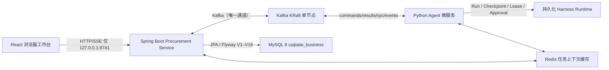
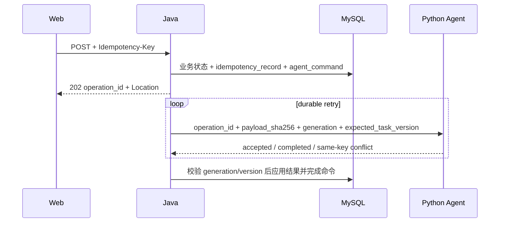

# 采价台架构

> 本文档只描述当前 0.5.0 架构（Java 业务主机 + Python Agent 微服务，Kafka 唯一通道）。
> 阶段执行顺序和重构进度见 [采购工作台重构总控](procurement-workbench-refactor-plan.md)。

## 服务拓扑（0.5.0）

Compose 默认启动 `procurement`、`agent`、`mysql`、`redis`、`kafka`（含 `kafka-init`）。
宿主机只映射 Java 的 `127.0.0.1:8741`；MySQL/Redis/Kafka/Python 8742 仅在 Compose 网络中可达。

### Kafka 契约

- topics：`caijiatai.commands`（Java→Python，3 分区按 aggregate_id 路由）、`caijiatai.results`、`caijiatai.rpc.requests`、`caijiatai.rpc.responses`、`caijiatai.events`，各配 `*.dlq`。
- 消息使用 `AGENT_INTERNAL_HMAC_KEY` 对完整规范 JSON envelope 做 HMAC-SHA256 签名，并双侧校验正文哈希；双侧幂等（Java `agent_command` outbox、Harness `internal_operations`）。
- 命令状态机：`pending → published → accepted → completed/failed`；瞬时错误最多投递 4 次，耗尽后持久化为可人工重试的传输失败。
- RPC：`get_task_context` / `get_artifact` / `list_events`，10s 超时 + 一次重试，correlationId 匹配。
- 事件：Harness 先持久化 Runtime 事件，再由 Kafka 适配器发布；Java 投影到 `caijiatai_business.runtime_event`（`global_seq` 唯一），Web SSE 从 Java 投影表读取。
- 心跳：Python 每 5s 发布 `heartbeat.ping`；`/api/health` 的 `agent_status` 以最近心跳（≤15s）判定。

数据库业务 schema 与运行时 schema 使用不同账号；首次初始化由 `deploy/mysql-init/02-users.sh` 从环境变量创建。已有数据卷不会重新执行 init 脚本，升级时需在维护窗口用同一脚本或等价 SQL 轮换旧账号并撤销跨 schema 权限。

### 已移除的旧边界

- Java 内部 HTTP：`/internal/v1/tasks/{id}/context`、`/internal/v1/artifacts/{id}/raw` 及 `X-Agent-Internal-Token` 鉴权分支已删除，由 Kafka RPC 取代。

## 所有权

| 所有者 | 唯一负责 |
|---|---|
| React | 采购任务、复核、比价、审批、报告和 Runtime 审计交互；不持久化业务真值 |
| Java | 任务、附件、报价、修正、Agent 绑定、快照、待决审批、正式决定、业务审计、业务 Artifact 和业务报告 |
| MySQL 业务 schema | Java 采购控制面持久化；Flyway 是唯一 Schema 创建机制 |
| Python | 文档解析、需求抽取、Provider/模型、Run、Session、Checkpoint、Lease、Approval、工具治理、Runtime Artifact 和抽取评测 |
| Harness Runtime volume | 保存 Python Runtime 事实；不保存当前采购业务真值 |

历史 SQLite/PostgreSQL 数据只离线归档；公共采购 Router、Service、costing 和采购 Repo 不在 Python 接线。旧数据不自动导入 MySQL。

## 持久命令

创建对话、结构化任务、报价导入、分析/恢复、审批和复制重开使用 MySQL `agent_command` outbox。业务状态与命令在同一事务接受：

同幂等键和同载荷返回原结果；同键异载荷返回 409。Python 暂时不可用时命令留在 outbox，任务标记 retryable 并自动重试。非重试业务错误将 operation 标记 failed，并把分析任务恢复到可修正的 `ready`，不会永久停在 `analyzing`。

## 采购生命周期

1. Java 原子保存 multipart 原件和 `start_conversation` 命令。
2. Python 解析需求与报价，返回带证据、置信度和 Runtime 绑定的结构化结果。
3. Java 保存报价；缺失、低置信度或冲突字段进入人工复核。人工修正只能经 Java API 写入。
4. Java 接受分析命令；Python 负责受治理编排，Java 规则引擎生成不可变比价快照。
5. 采购员选择合格供应商或带原因流标。Java 创建绑定当前证据的 `pending_decision` 并调度 Python。
6. Python 只有在 Harness 生成的 `procurement_approve_supplier` Approval 与绑定逐项一致时才返回 allow-once 证据。
7. Java 最终事务锁定任务并复核版本、快照、输入哈希、报价资格、审批摘要和审批日期，原子写入决定、终态、审计及执行 Artifact。

需求或报价改变会增加 generation、清除当前快照并将 pending/approved 待决审批标记 stale。迟到结果返回 stale approval；旧 Run、快照和审计仍保留。

## 确定性边界

Java 使用 `BigDecimal` 计算计价单位、税、运费、汇率、总到货成本和单价。V1 检查包装固定规格；V2 按动态规格 label/key 映射并支持 `µm/mm/cm/m` 换算、精确、公差、范围和上下界。资格淘汰先于排序，同成本时按交期、供应商名和报价 ID 稳定排序。

线路 Decimal 使用普通十进制字符串，禁止指数形式。规范 JSON 固定 UTF-8、键排序、无空白和尾零规范化；Java 字节与 `contracts/golden/` 中冻结 Python 基线一致。

## Artifact 与报告

- 采购原件、比价快照、采购订单和供应商确认邮件归 Java。
- 模型消息、工具结果和 Runtime 报告归 Python。
- Java Artifact Store 使用 SHA-256 两级分片、临时文件和原子移动，并校验 locator 与任务所有权。
- 公共 Artifact ID 使用确定性所有者前缀，Java 不对未知 ID 做含糊回退。
- 批准终态缓存带 Run ID 和证据哈希的不可变 Runtime 报告投影。
- Python 不可用时，采购报告仍返回 HTTP 200 并明确 Runtime 证据状态；`/api/runs/**` 继续读取 Java 事件投影，实时 `/api/runtime` 可用性检查返回结构化 503。

## Runtime 与 SSE

Java 只提供显式允许的 Run、Checkpoint、Approval、Artifact 和 SSE 路径，不提供指向 Python 的任意路径代理。Web SSE 与 Run 审计从 Java 的 `runtime_event` 投影读取，保留事件 ID、`Last-Event-ID`、心跳和重连；断流时 Web 执行有界轮询。

Java readiness 只依赖 MySQL。Agent 可用性作为 `/api/health` 的独立降级字段，避免 Python 短暂故障使业务报告或 Java readiness 不可用。
