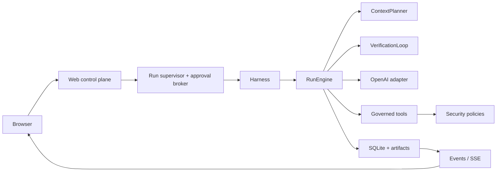
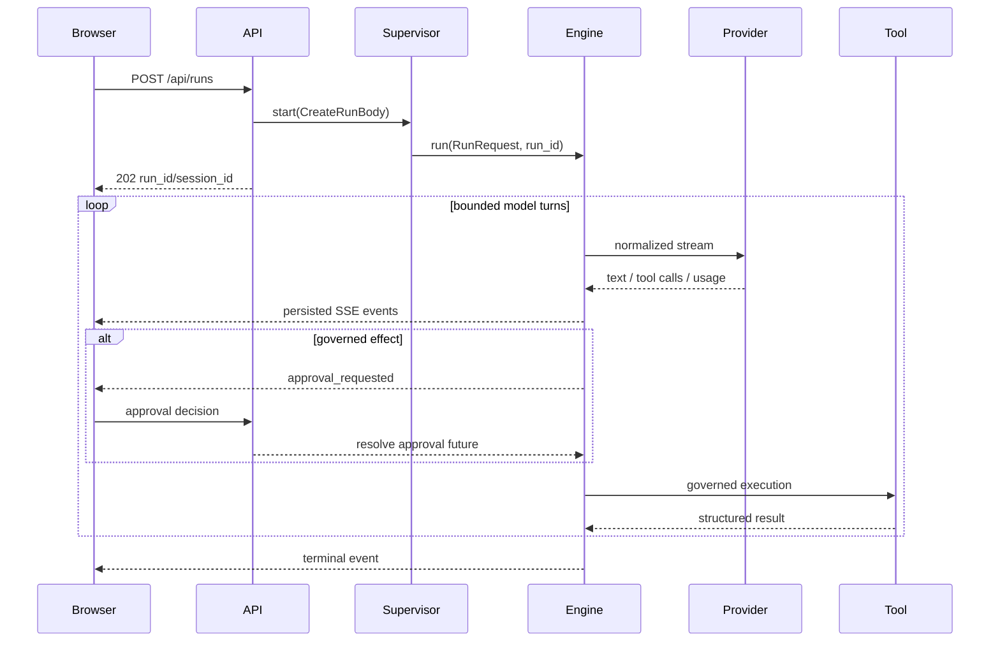

# Architecture

Agent Harness v0.3 has one product path: the browser calls a narrow FastAPI control plane, which calls the Python Agent Runtime directly.

## Boundaries

| Boundary | Responsibility |
|---|---|
| `Harness` | Dependency composition, run/resume/cancel and stable read queries |
| `RunEngine` | Agent state machine: model turns, budgets, OpenAI retry, verification orchestration and process control |
| `RunContext` registry (`engine/run_state.py`) | All per-run in-memory state, created and torn down atomically |
| `EventEmitter` (`engine/events.py`) | Event envelopes, persisted fan-out to observers, text-delta buffering |
| `LeaseManager` (`engine/lease.py`) | Single-writer run lease acquire/heartbeat/release |
| `RunLifecycle` (`engine/lifecycle.py`) | Checkpoints, resume invariants and terminal state |
| `ToolInvocationExecutor` (`engine/tool_execution.py`) | Governed tool batches: validation, approvals, effect-aware scheduling, retry/reconcile recovery, result bounding |
| `RunSpawner` | Narrow surface tools get via `ToolContext.harness`: storage + run + child_run_ids |
| `ContextPlanner` | Authorized context sources, token budgeting, compaction and manifests |
| Auto-compaction (`engine/compaction.py`) | Threshold-triggered selection of old message groups, bounded summarization call, rolling-summary state applied through the planner |
| `VerificationLoop` | Deterministic output, file, governed command and independent-model checks |
| OpenAI adapter | Normalized async `stream(ModelRequest)` contract for OpenAI and compatible gateways |
| Tool | Backward-compatible `ToolSpec`/`run` plus schema, timeout, replay and concurrency policy |
| `Storage` | Stable facade over per-domain repos (`storage/*.py`) sharing one `StorageCore` (writer lock + per-thread readers) |
| `WebRunSupervisor` | Background task ownership, configured workspace roots and Web approval futures |
| FastAPI | Narrow local control plane and SSE; no Agent logic |

## Run lifecycle

The API generates the run and session identities before scheduling work, so a browser receives a stable handle immediately. Shutdown interrupts owned runs before closing providers, tools and SQLite.

## Context compaction

Before each planning step the engine compares the not-yet-summarized history against `context_compact_ratio × max_context_tokens`. Above the threshold it summarizes the oldest complete groups with one bounded, tool-free provider call, replaces the previous rolling summary (prior summary text is chained into the new call), externalizes the originals as an artifact and stores covered message ids in the planner state. The planner renders the summary inside the stable prefix and excludes covered groups from later turns, marking them `summarized` in the manifest. The state travels with every checkpoint, so resume continues from the compacted view. Any summarization failure emits a skipped `context_compacted` event and the run continues; the planner's budget externalization remains the hard limit. Provider-reported prompt-cache reads are accumulated per turn into `usage.cached_input_tokens` / `cache_hit_rate`, and cost estimates price cached input at `cached_input_per_million_usd` when configured.

## Workspace model

Workspace roots are operator configuration supplied at process start. Web requests select a root by opaque id and may provide only a relative subdirectory. The server resolves the real path and rejects absolute paths, traversal, missing directories and symlink escapes.

Inside a run, filesystem tools apply their own real-path sandbox again. The two checks defend different boundaries: the API prevents a browser from selecting arbitrary host directories; tools prevent model-produced arguments from leaving the authorized run roots.

## Persistence

SQLite migrations are numbered, transactional and forward-only. A run lease is owned by one runtime and renewed by heartbeat. Only expired active leases are recovered as `interrupted(process_lost)`.

Each tool invocation is persisted before execution and transitions through `received`, `validated`, approval, `running`, and a terminal state. A persisted terminal result is reused if message/checkpoint materialization was interrupted. Safe reads may retry after process loss, reconcilable writes inspect their target state, and non-replayable operations become `indeterminate` and require human review instead of being executed twice.
