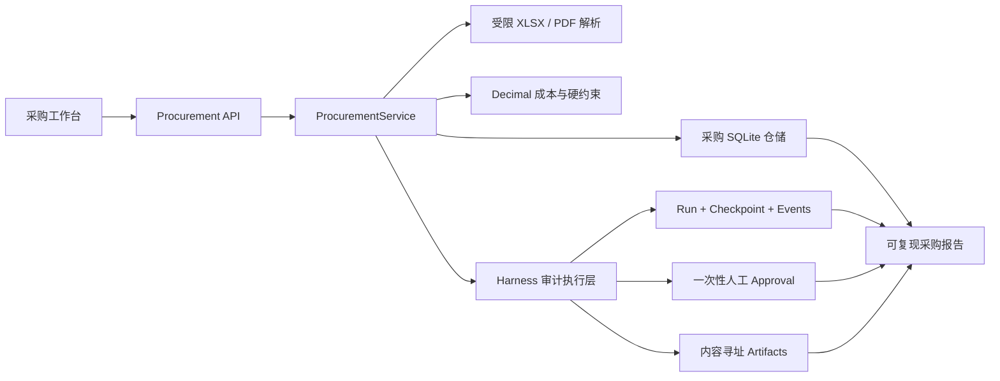
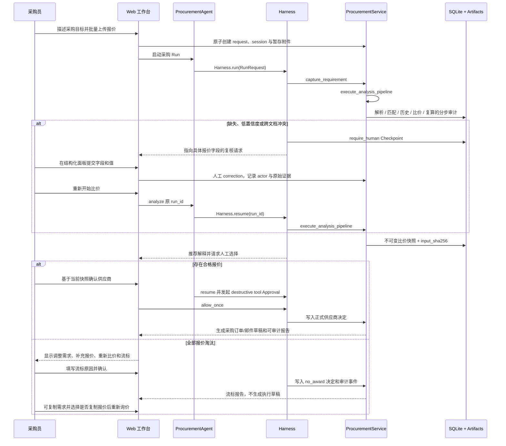

# 采价台架构

采价台的产品入口是采购任务工作台。采购业务域拥有需求、报价、字段校对、成本、比较快照和供应商决定；Agent Harness 继续拥有 Run、Checkpoint、Approval、Artifact、事件和受治理工具执行。

## 责任边界

| 边界 | 责任 |
|---|---|
| Procurement Web | 需求创建、报价上传、证据校对、供应商比较、人工审批和报告；不提供通用聊天入口 |
| `api/procurement.py` | 公共请求模型、大小限制、Base64 文件边界和采购端点错误映射 |
| `procurement/parsing.py` | 不可信文件资源限制、XLSX/PDF 文本解析、字段类型、来源定位和置信度 |
| `procurement/costing.py` | 唯一金额实现：单位、税率、汇率、运费、MOQ、交期、V1 包装规格或 V2 动态规格、发票、预算、有效期和排序 |
| `procurement/service.py` | 业务状态机、快照失效、正式审批、业务审计和 Harness 关联 |
| `storage/procurement.py` | 采购表的唯一 SQL 所有者，共用 `StorageCore` 的 WAL 与写锁 |
| `Harness` | Agent Runtime 依赖组合、Run/Checkpoint/Approval/Artifact/事件和稳定读取接口 |
| `RunEngine` | 保留的模型循环、预算、恢复、验证和受治理工具执行；不参与采购金额计算 |

## 对话式采购生命周期

每个任务稳定关联 `session_id`、`purchase_request_id` 和 `run_id`。模型只能调用 `procurement_read_request`、`procurement_capture_requirement`、`procurement_execute_analysis` 和 `procurement_approve_supplier`。报价事实只能经结构化人工校正 API 修改，不能从模型自由文本写入。金额、报价版本、快照及审批状态均从领域事实读取。

`execute_analysis_pipeline` 在一次工具调用中依次执行解析、物料身份与规格匹配、供应商历史、确定性比价、独立复算和人工选择项生成，同时保留每个内部阶段的业务审计。任何报价修正或新增报价都会清除当前快照引用并使旧审批失效，但旧快照、Run 和事件仍保留供审计。正式批准或流标后需求冻结，不能再修改报价或重算；复制重开会创建新的 request、session 和审计关联，旧任务保持不可变。

## 确定性边界

`canonical_analysis_input()` 只包含采购数量、规格、约束、固定汇率、报价原件 SHA-256 和当前人工确认值。其规范 JSON 产生 `input_sha256`。V1 保留包装字段和历史规则哈希；V2 将动态规格定义与报价规格纳入哈希，并按单位换算、匹配方式和优先级检查。成本使用 `Decimal`，金额展示按明确精度量化；资格淘汰先于排序；最低总到货成本决定推荐，同成本时按交期、供应商名和报价 ID 稳定排序。没有合格报价时推荐 ID 为空，只能写入 `no_award` 决定。

比较结果、输入哈希、规则版本和审批绑定哈希写入不可变快照。采购报告对持久化事实再次计算 `evidence_sha256`，所以刷新与进程重启不会改变报告。

## 不可信文档

文件扩展名、大小、XLSX ZIP 结构、工作表数、行列数、PDF 页数、提取字符数和加密状态均在解析前或解析中受限。扫描件 OCR 当前明确拒绝。Artifact Store 保存原件内容与 SHA-256；结构化字段保存文档类型、页码/单元格、原文摘录、方法、置信度和人工修正。

## Runtime 兼容性与恢复

原有 `WebRunSupervisor`、`RunEngine`、工具治理、进程丢失恢复、SSE 和嵌入式 `Harness.run/resume/cancel` 保持可用。`GET /api/runs/{id}/report` 仍从持久化 Run、事件、工具、审批和 Artifacts 投影证据，不引入第二份 Runtime 状态。

审批工具成功后返回由受信任后端生成的 `final_output`。`RunEngine` 仍对其执行脱敏、输出预算和既有 Verification，再写终态 Checkpoint；已提交的确定性决定不需要额外模型回合来复述。

进程重启时，SQLite 中的 Run、Checkpoint、消息、工具调用和采购事实共同恢复。`require_human` 从原 `run_id` 继续；运行中的进程丢失会由租约恢复为可解释的中断状态，副作用工具不会凭空重复执行。V10 决策表允许 `quote_id` 为空并以受限枚举区分 `approved` 与 `no_award`，旧 V1 决策和快照可直接读取。Provider 的 429、超时和重试均以事件及 `usage.provider_attempts` 记录，不依赖上游控制台是否展示同一状态码。
