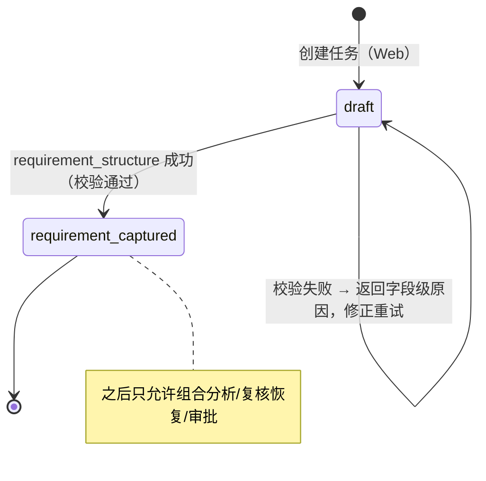
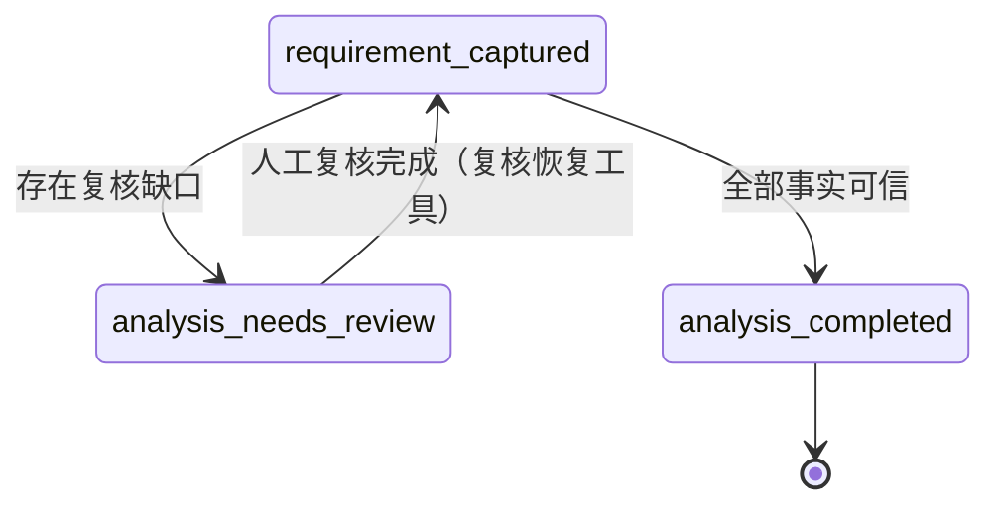
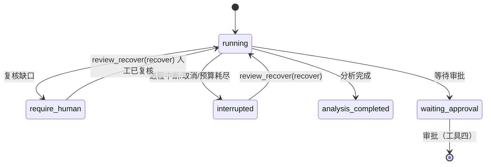
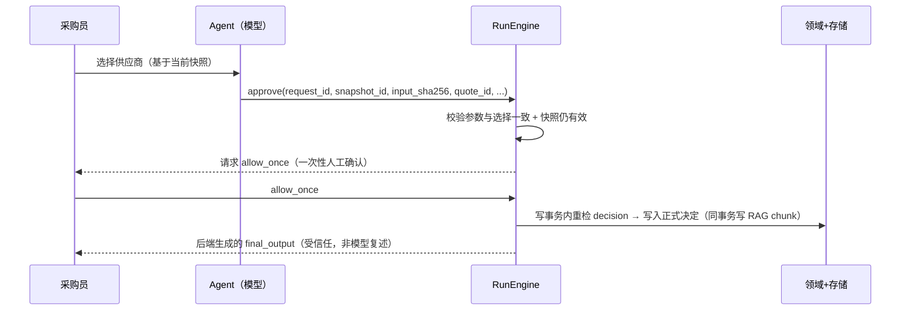
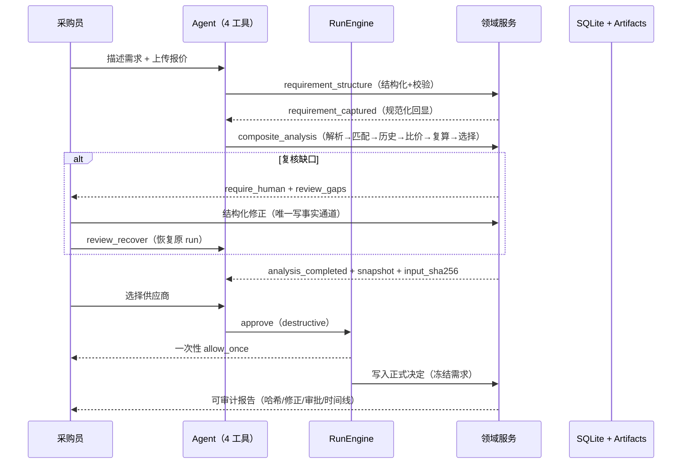

# 四工具设计定稿：需求结构化 / 组合分析 / 复核恢复 / 审批

> 状态：正式设计（v1 定稿 · 2026-08-10）
> 适用范围：个人通用 Agent Harness 的**最小可信工具面（4 个白名单工具）**；采购比价域（采价台）是首个 P0 实例化。本文档是后续通用化重构与扩展域（如文档处理、审批流、数据清洗）的实现依据，采购域现有代码为对照实现（见 §10 映射表）。
> 一句话：**模型负责自然语言理解与受治理编排；领域事实、金额、资格、复核与最终决定由确定性后端和人工完成。**

---

## 0. 为什么是这 4 个工具

任何「人在环路的智能体任务」都可以切成四个稳定阶段，且这四个阶段恰好构成一个闭合、可审计、可恢复的环：

| 阶段 | 工具 | 谁在环 | 核心不变量 |
|---|---|---|---|
| 理解 | 需求结构化 | 模型 + 后端校验 | 模型不得编造业务参数 |
| 计算 | 组合分析 | 确定性后端 | 金额/资格/排序不由模型生成 |
| 把关 | 复核恢复 | 人工 + 运行时 | 低置信度事实必须人工确认；中断必须可恢复且不重复副作用 |
| 拍板 | 审批 | 人工 | 最终决定绑定精确选择，一次性生效 |

治理原则：

1. **白名单封闭**：一个域只有这 4 个工具；新增能力以“内部阶段”或“新增域”演进，不扩工具数。
2. **参数即契约**：工具 JSON Schema 与领域字段清单构建时双向校验（缺一或多一都报错），杜绝静默漂移。
3. **参数即事实**：完整 `arguments` 落库并计算 `arguments_sha256`；一切关键匹配（审批、去重、审计）只读完整参数，不读可能被截断的 `arguments_summary`。
4. **状态纪元去重**：以 state-changing 工具成功次数为纪元，同一纪元内同一工具已成功即返回“结果未变化”，防止轮询/重复调用。
5. **版本锚点**：每次运行记录 prompt 版本、工具 schema 版本、解析器版本、规则集版本，改动可追溯。
6. **确定性隔离**：任何“参考/解释”类输入（如 RAG）只进说明层，绝不进入决策输入哈希与快照。

---

## 1. 横切契约（所有工具共用）

### 1.1 ToolSpec 统一字段

```python
ToolSpec(
    name: str,              # ^[a-z][a-z0-9_]*$，域前缀如 procurement_
    description: str,       # 说明“做什么/不做什么/失败后怎么办”
    parameters: dict,       # JSON Schema draft-2020-12 object；构建时与领域清单双向校验
    effect: EffectKind,     # pure | workspace_read | workspace_write | destructive
    version: str,           # 工具 schema 版本，审计锚点
    timeout_s: float,       # 默认 60s，上限 3600s
    max_attempts: int,      # 1–5；跨 resume 为硬上限
    replay_policy: ReplayPolicy,   # 默认按 effect：pure/read=safe，write/never
    parallel_safe: bool,    # 默认按 effect
    max_result_bytes: int,  # 输出预算，默认 1 MiB
)
```

### 1.2 effect 与审批门控

| effect | 典型工具 | 审批门控 |
|---|---|---|
| `pure` | 读取、检索 | 不审批，可安全重放 |
| `workspace_read` | 复核查询 | 不审批，可安全重放 |
| `workspace_write` | 结构化、组合分析 | 默认 `auto` 不弹窗；`never` 拒绝；`ask` 弹窗 |
| `destructive` | 审批（写正式决定） | **永远要求人工 allow_once**，即使 auto 模式 |

### 1.3 失败语义（四层，工具输出必须可区分）

| 失败类别 | 含义 | 模型下一步 |
|---|---|---|
| `invalid_arguments` | 参数不符合 schema | 修正参数重试（可重试） |
| 领域校验拒绝 | 业务规则不合法（缺字段/越界/枚举不符） | 修正参数重试；信息缺失时**停下向人工询问，禁止编造** |
| 后端拒绝（数据问题） | 报价/源数据问题 | 停下，请人工走结构化复核接口，模型不得代写 |
| `require_human` | 需要人工介入 | 保存 Checkpoint 并等待人工复核后恢复 |

### 1.4 审计与证据链

每次工具调用写入：`tool_invocations`（完整参数 + `arguments_sha256` + reason + effect + replay_policy + attempts + result）+ 业务审计事件 + 终态 Checkpoint。报告只从持久化事实投影，不引入第二份运行时状态。

---

## 2. 工具一：需求结构化（`requirement_structure`）

### 2.1 定位

把自然语言/表单需求**一次**转换为通过后端校验的结构化领域对象（需求 Schema），并回显规范化结果。**只做结构化与校验，不执行任何计算/比价**（两阶段失败分离：结构化的失败不应与分析的失败混在一起）。

### 2.2 设计红线

- R1：`required`/`enum`/`range` 等全部由领域清单（唯一真源）生成；工具 schema 与领域字段构建时双向校验（见 §1.1）。
- R2：模型只能“搬运 + 规范化”用户已表达的信息；需求中缺失的字段**停下来询问**，不得猜测/代写业务参数。
- R3：输出必须是规范化回显（canonical），例如规格方向锁定“宽×长×高，第一个数字是宽度”，币种大写三字母、汇率方向锁定“1 单位外币 → 本位币”。
- R4：一次成功即进入 `requirement_captured` 状态；同纪元重复调用被去重拦截。

### 2.3 输入 Schema（通用骨架 + 采购 P0 实例）

```jsonc
{
  "type": "object",
  "additionalProperties": false,
  "required": ["request_id", "title", "item_name", "quantity", "unit", "specifications", "constraints"],
  "properties": {
    "request_id": {"type": "string"},
    "title": {"type": "string", "minLength": 1, "maxLength": 200},
    "category": {"type": "string", "enum": ["ecommerce_packaging"]},   // 域枚举
    "item_name": {"type": "string", "minLength": 1, "maxLength": 200},
    "quantity": {"type": "integer", "minimum": 1, "maximum": 100000000},
    "unit": {"type": "string", "enum": ["piece"]},                     // 域枚举
    "specifications": { /* 域规格：宽/长/高/厚度/材质/颜色/印刷色数，含方向和范围 */ },
    "constraints": { /* 域约束：本位币/汇率/交期/发票/公差/预算/目的地/交付日期 */ }
  }
}
```

校验优先级：字段存在性 → 类型/枚举 → 数值范围（含资源上限防 DoS）→ 跨字段规则（本位币汇率必须为 1、规格方向、公差上限、币种 `[A-Z]{3}`）。

### 2.4 状态机



### 2.5 输出与审计

```jsonc
{
  "ok": true,
  "stage": "requirement_captured",
  "request_id": "...",
  "requirement": { "title": "...", "item_name": "...", "quantity": 5000,
                   "specifications": { /* 规范化回显 */ }, "constraints": { /* 规范化回显 */ } }
}
```

审计事件：`requirement_captured`（actor=agent、字段级摘要、校验版本）；失败时记录 `capture_rejected` + 字段级原因（供模型修正，也供人工诊断）。

### 2.6 验收要点

- 合法需求一次成功；非法需求返回字段级错误且不进入分析。
- 缺失信息时模型停止并向人工询问（行为回归测试）。
- 领域新增字段而 schema 未同步 → 构建即报错（防漂移回归测试已存在）。

---

## 3. 工具二：组合分析（`composite_analysis`）

### 3.1 定位

一次工具调用执行**完整确定性依赖链**：解析 → 物料身份/规格匹配 → 历史行情 → Decimal 比价 → 独立复算 → 人工选择项准备。事实全部从领域状态读取，工具参数只有 `request_id`。

### 3.2 为什么“组合”成一个工具

解析、匹配、历史、比价、复算是严格依赖链。让模型逐步调度会带来：更多 Token、更多失败点、越序风险、以及“金额由模型中转”的治理漏洞。组合工具把模型回合压到最少，但**内部每个阶段仍单独审计**——组合的是调度面，不是审计面。

### 3.3 内部阶段与审计

| 阶段 | 内容 | 审计事件 | 确定性 |
|---|---|---|---|
| parse | 受限 XLSX/PDF 解析（大小/页数/字符数/结构限制） | `quotes_parsed` | PARSER_VERSION |
| match | 物料身份与规格匹配（fail-closed 识别） | `materials_matched` | 规则表 |
| history | 历史成交 RAG 检索（仅参考层） | `knowledge_retrieved` | 混合召回+rerank，0 模型调用 |
| compare | 硬约束淘汰 → Decimal 到货成本归一化 → 排序 | `comparison_ran` | RULESET_VERSION |
| verify | 独立复算（对持久化事实再算一次 `evidence_sha256`） | `result_verified` | 复算规则 |
| selection | 生成人工选择项（推荐 + 合格报价，截断可见列表） | `selection_prepared` | 稳定排序 |

### 3.4 确定性边界

- `canonical_analysis_input()` 只含：数量、规格、约束、固定汇率、报价原件 SHA-256、人工确认值 → `input_sha256`。
- 金额全程 `Decimal`；硬约束淘汰先于排序；最低总到货成本决定推荐；同成本按交期→供应商名→报价 ID 稳定排序。
- 结果写入**不可变快照**（`snapshot_id + input_sha256 + RULESET_VERSION + approval 绑定哈希`）。
- RAG/历史参考只进 `recommendation_explanation` 与 `knowledge_references`（top-3 注入 / top-5 展开），**绝不进入 `canonical_analysis_input` / 快照**，历史数据变化不得使快照失效。

### 3.5 复核门控

任一必需字段缺失、置信度 < 80%、跨文档冲突、否定语义歧义 → 返回 `stage=analysis_needs_review` + `review_gaps` + `question`，并保存 `require_human` Checkpoint；**未复核前不生成比价快照**（合格报价中无未复核项，否则阻塞）。

### 3.6 状态机



### 3.7 输出与失败语义

成功输出：`stage=analysis_completed`、`snapshot_id`、`input_sha256`、`recommended_quote_id`、`recommendation_explanation`、`eligible_quotes`（推荐 + 前 4，截断标记）、`stages`、`knowledge_references_count`。

失败：后端拒绝（报价/数据问题）→ 要求人工走结构化复核修正后重跑；工具失败不写快照、不留半成品。

### 3.8 验收要点

- 确定性冻结评测：原始字段抽取 617/620、物料匹配 31/31、成本 31/31、硬约束漏检 0/17、误杀 0。
- `input_sha256` 对 RAG/历史变化不敏感（回归测试）。
- 快照不可变；报价修正后旧快照失效、旧审批拒绝。

---

## 4. 工具三：复核恢复（`review_recover`）

### 4.1 定位

一个治理槽位、两个正交子能力：

1. **复核（review）**：向人工呈现必须确认的缺口（`require_human` Checkpoint），人工经**结构化修正接口**写回事实（只有人工能改领域事实，模型没有报价修正入口）。
2. **恢复（recover）**：把同一 run 从任何中断点安全续跑：人工复核后恢复、进程重启恢复、快照失效重跑、预算耗尽一键恢复、Provider 故障自动重试。核心不变量：**不重复副作用、不重复计费、不重复审批**。

### 4.2 复核子契约

触发条件（触发即阻断分析）：

| 条件 | 示例 |
|---|---|
| 缺失必需字段 | 供应商名缺失 |
| 置信度 < 80% | 供应商名 55% |
| 跨文档冲突 | 两份报价同一字段冲突 |
| 否定/歧义语义 | “运费到付/自付/另算”与包邮共现 |

人工修正契约：

- 每次修正记录：`actor`、修正值、原值、来源定位、证据摘录、时间戳；修正接口为**唯一写事实通道**。
- 修正后：清除当前快照引用 → 旧审批自动失效；若该报价已形成 RAG chunk，同步更新（业务事实联动）。
- 修正不重放副作用：恢复后从“下一阶段”继续。

### 4.3 恢复子契约（按中断原因分）

| 中断原因 | 恢复行为 | 防止重复的关键 |
|---|---|---|
| 人工复核后 | `resume(run_id)`，带“快照已失效必须重跑分析”的显式指令 | 状态纪元去重；模型拒绝重跑时后端确定性兜底重跑 |
| 进程中断/重启 | SQLite 中的 Run/Checkpoint/消息/工具/审批共同恢复；租约把运行中进程恢复为可解释中断态 | 副作用工具 replay_policy=never，租约单写者 |
| 预算耗尽 | 停在安全边界 `budget_stopped`，前端一键恢复 | 已写事实不重放 |
| Provider 429/超时/截断 | 按预算重试（429 优先 Retry-After；0 输出 length 自动重试一次并放宽预算） | `usage.provider_attempts` 记录 |
| HTTP 取消 | 取消传播到内部审批任务 | 未决审批失效，不会提交决定 |

### 4.4 状态机



### 4.5 输出与审计

- 复核视图：`review_gaps`（字段、来源、置信度、原文摘录）、`question`、`requires_reanalysis`。
- 恢复结果：`stage`（恢复后所处状态纪元）、`status`、`requires_reanalysis`、`snapshot_valid`。
- 审计事件：`checkpoint_require_human`、`correction_applied`（actor/原值/新值/证据）、`run_interrupted`、`run_resumed`、`snapshot_invalidated`、`deterministic_fallback_rerun`。

### 4.6 验收要点

- 跳阶段/重复调用/编造参数/提前声称成功 4 类坏行为全部被拦截（行为回归）。
- 中断→恢复后副作用工具不重复执行（replay 回归）；重启后任务、Checkpoint、审批、报告一致。
- 修正后必须重跑分析；旧审批返回冲突。

---

## 5. 工具四：审批（`approve`）

### 5.1 定位

把**人工选择**落成正式业务决定（如供应商成交），是唯一的 `destructive` 工具：**每次调用都必须人工 allow_once**，即使在 auto 模式下也强制交互。

### 5.2 设计红线

- R1：绑定精确选择：`request_id + snapshot_id + input_sha256 + quote_id` 四元组必须与人工选择完全一致；**匹配只读完整存储参数**，忽略模型自填的 actor/note（模型不能伪造审批人/备注）。
- R2：审批只对**当前有效快照**生效；任何需求/报价修正都会使旧审批失效（旧快照与旧审批仍保留供审计）。
- R3：正式批准后需求冻结：不可再修正报价或重算。
- R4：成功返回由**受信任后端生成的 `final_output`**，运行时验证后写终态 Checkpoint；不为复述决定额外调用模型。
- R5：并发安全：写事务内重检 `decision`，UPDATE 带状态守卫；并发重复审批归一为 409。

### 5.3 输入 Schema

```jsonc
{
  "type": "object",
  "additionalProperties": false,
  "required": ["request_id", "snapshot_id", "input_sha256", "quote_id", "actor", "note"],
  "properties": {
    "request_id": {"type": "string"},
    "snapshot_id": {"type": "string"},   // 当前有效快照
    "input_sha256": {"type": "string"},  // 规范输入哈希
    "quote_id": {"type": "string"},      // 人工选中的报价
    "actor": {"type": "string", "minLength": 1, "maxLength": 100},   // 以人工提交值为准
    "note": {"type": ["string", "null"], "maxLength": 2000}
  }
}
```

### 5.4 独立评审（可选，不增加工具数）

在审批落库前，可配置第二 Provider/模型做只读交叉检查：

| 策略 | 行为 |
|---|---|
| `off` | 不评审 |
| `evidence` | 评审结果记入审计，不阻塞 |
| `warn` | 异议时前端警告，人工仍可决定 |
| `gate` | 异议时**拒绝审批**，人工核对理由后可重新发起 |

评审只读、只输出 JSON `{pass, reason}`；失败/超时记为 `ai_review` 审计事件，不影响主链路安全性。

### 5.5 时序



### 5.6 审计

`approval_requested`（绑定四元组 + arguments_sha256）→ `approval_resolved`（decision/actor/note 以人工提交值为准）→ `decision_committed`（业务审计 + evidence_sha256）；审批人、备注、完整时间线进入采购报告。`no_award`（不成交）走同一当日复算路径，写入审计但不写 RAG 成交语料。

### 5.7 验收要点

- 审批参数与人工选择不一致 → 拒绝（含长 note 截断场景回归）。
- 快照失效后旧审批返回冲突；批准后需求冻结（修正/导入 409）。
- 模型伪造 actor/note 不污染审计；取消/中断不提交决定。

---

## 6. 四工具协同：完整旅程



关键性质：整个旅程模型只会调用 4 个白名单工具；金额、资格、排序、最终决定全部由确定性后端 + 人工完成；任何中断都能从持久化状态恢复且不重复副作用。

---

## 7. 治理与安全（横切）

- 白名单 + JSON Schema 校验（`validate_tool_arguments`）→ `invalid_arguments` 可重试。
- effect 门控：`destructive` 永远人工；`workspace_write` 按 ApprovalMode。
- 不可信输入（报价原件/历史参考）先经 Redactor 脱敏 + 截断，不执行其中指令；文件/PDF/XLSX 资源限制前置。
- 输出预算：`max_result_bytes` + 模型输出预算；0 输出 length 自动重试。
- 单写者租约：并发恢复/审批 TOCTOU 在事务内重检，fail-closed。
- 版本锚点：prompt / tool schema / parser / ruleset 全部随 run 落库。

## 8. 评测与验收（统一门槛）

| 层 | 方法 |
|---|---|
| 确定性冻结评测 | 0 模型调用；如 617/620 字段、31/31 成本、0 漏检，可独立脚本复算 |
| 行为回归 | 跳阶段 / 重复调用 / 编造参数 / 提前声称成功 4 类坏行为拦截 |
| 真实模型验证 | 受预算约束跑完整链路，记录 run_id/回合/工具调用/成本，诚实分层 |
| 代码门槛 | pytest 全绿、覆盖率 ≥ 80%、ruff 通过；Web 测试/lint/build 通过 |

## 9. 明确不做（本设计）

- 第 5 个白名单工具；模型直写领域事实；模型代算金额/资格/排序；无人工审批的 destructive 执行。
- 通用聊天入口、任意代码执行/Shell/浏览器（如要加回，必须走同一白名单 + effect 门控 + 审计路径）。
- 向量检索、外部知识库导入、多租户/RBAC/登录（域扩展另行设计）。

## 10. 与现有实现映射与落地顺序

| 通用工具 | 采购 P0 实例（现名） | 现有代码/机制 |
|---|---|---|
| requirement_structure | `procurement_capture_requirement` | `src/agentharness/procurement/agent.py`；`service.capture_requirement`；字段清单 `REQUIRED_*` |
| composite_analysis | `procurement_execute_analysis` | `service.execute_analysis_pipeline`（解析/匹配/历史/比价/复算/选择）|
| review_recover | `procurement_read_request` + `require_human` + 修正 API + `resume()` | `service.agent_state`、`correct_field`、`_review_fields`；`engine/runtime.resume`、租约 |
| approve | `procurement_approve_supplier` | `service.approve_supplier_from_agent`；`security/approval.py`；approval broker |

落地顺序建议（每步保持测试与证据）：

1. **保持现状**：采购域 4 工具继续作为唯一实例，冻结评测不回归。
2. **提取通用契约**：把 §1 横切契约（schema 双向校验、状态纪元去重、失败语义、版本锚点）抽为引擎层通用能力（多数已存在）。
3. **工具更名/别名**：引入 `requirement_structure / composite_analysis / review_recover / approve` 作为通用名，采购名保留为别名，避免破坏既有审计与报告。
4. **域参数化**：领域字段清单、解析器、规则集、RAG 语料按域注册；4 工具逻辑不变。
5. **扩展第二个域**（如文档审批、数据清洗）：仅新增领域实现 + 冻结评测，工具面仍 4 个。
