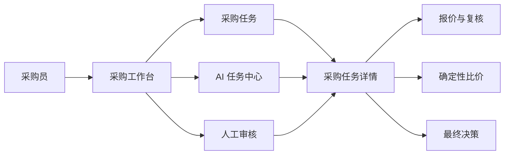

# 采价台采购工作台重构总控

> 文档版本：1.0
>
> 文档类型：唯一阶段计划、执行顺序和验收门禁
>
> 当前状态：阶段 0-10 已完成
>
> 更新规则：每完成一个阶段，只更新本文件对应的状态、证据和遗留问题；不另建平行路线图。

## 1. 产品契约

面向采购员，采价台帮助用户把采购需求和多家报价转化为一份可解释、可追踪、经过人工确认的采购决策。

唯一必须跑通的业务结果：

```text
创建采购需求
  -> 收集多家报价
  -> 异步解析与分析
  -> 查看可解释结果和来源
  -> 人工审核、修改或驳回
  -> 形成最终采购决策和审计报告
```

### 1.1 核心用户旅程

| 旅程 | 入口 | 用户动作 | 系统结果 | 可见确认 | 主要恢复路径 |
|---|---|---|---|---|---|
| 创建与收集 | 工作台“新建采购任务” | 填写需求、上传两份以上报价 | Java 持久化任务和原件，创建异步操作 | 返回任务编号、操作编号、上传计数 | 校验错误保留表单；Agent 不可用时保留 outbox 并显示可重试 |
| 分析与审核 | 任务详情或 AI 任务中心 | 启动分析、查看步骤、检查来源、修正字段 | Python 解析/运行，Java 计算确定性比价快照 | 每一步有状态、时间、错误和结果摘要 | 失败可重试；缺字段回到复核；过期结果被标为 stale |
| 决策与归档 | 人工审核队列 | 确认、修改后通过、驳回重跑或流标 | Java 原子写入正式决定、审计和执行 Artifact | 显示最终供应商/流标、证据指纹、报告下载 | 重复提交幂等；并发修改拒绝旧审批；终态可复制重开 |

### 1.2 产品边界

**本轮必须交付**

- 采购任务工作台首页和任务详情的清晰导航。
- 独立的 AI 任务视图：列表、状态、步骤、失败原因、重试和结果入口。
- 独立的人工审核视图：AI 建议、证据、报价比较、人工最终值和审核记录。
- Java 业务真源、Python Agent 真源、Kafka 异步契约保持单一所有权。
- 刷新、断流、Agent 重启、重复操作、过期结果和全部淘汰等可恢复状态。

**有价值但后置**

- 历史成交知识检索和 RAG 反馈闭环。
- 供应商档案与历史表现独立管理页。
- 多用户、RBAC、通知中心和高并发扩展。

**明确不做**

- 重写现有 Agent 引擎或引入 LangGraph/MCP。
- 为单用户本地形态引入网关、注册中心、分布式事务或分布式锁。
- 让 LLM 直接计算金额、改变报价真值或写入最终决定。
- 同时维护旧、新两套采购业务真源。

## 2. 当前基线（阶段 0 结论）

### 2.1 已存在的能力

- React/Vite 前端已有采购任务列表、需求确认、报价上传、字段证据复核、确定性比价、审批报告和运行审计。
- Spring Boot Java 已拥有采购任务、附件、报价、修正、比较快照、待决审批、正式决定、审计、Artifact、outbox 和事件投影。
- Python Agent 已拥有需求抽取、XLSX/PDF 受限解析、Provider 配置、Kafka 命令消费、结果回传、Runtime 事件和幂等记录。
- Compose 已包含 MySQL、Redis、Kafka、Python Agent 和 Procurement Service 五个服务；宿主机只暴露 `127.0.0.1:8741`。
- 当前验证基线：Python `241 passed, 1 skipped`；Web `24 passed`；Web build 成功；Java `36 tests passed`。这些是本轮盘点时的工作树结果，不代表后续改动自动继承通过。

### 2.2 当前真源与职责

| 事实 | 当前 owner | 说明 |
|---|---|---|
| 采购任务、报价、修正、比较、决定、报告 | Java + `caijiatai_business` | Flyway V1-V7 管理业务 schema |
| Agent 命令投递和幂等 | Java `agent_command` + Python `internal_operations` | 至少一次投递，双侧幂等 |
| AI/运行时事件 | Python runtime MySQL -> Java `runtime_event` 投影 | Web SSE 从 Java 投影读取 |
| 原始文件和执行草稿 | Java Artifact Store | SHA-256、owner 校验、原子移动 |
| LLM/解析 | Python | 不写采购业务真值 |
| 金额、资格、排序 | Java `ComparisonEngine` | `BigDecimal` 确定性计算 |

### 2.3 关键差距

1. `agent_command` 是可靠操作记录，但不是面向采购员的独立 AI 任务模型；当前没有跨采购任务的 AI 任务中心。
2. 当前 `analyze` 命令主要发布运行生命周期事件，真正的确定性比价在 Java 完成；完整的“文件解析 -> 规则分析 -> RAG -> LLM 总结”尚未成为可观测的 AI 步骤链。
3. 人工复核能力分散在报价字段修正、待决审批和报告页面，没有独立的审核队列和统一审核状态。
4. 采购状态和 Agent 操作状态分散且语义不同，前端容易把“AI 成功”误显示为“采购完成”。
5. 当前前端以单任务详情为中心；任务筛选、右侧详情、失败恢复和 URL 可恢复导航仍需统一。
6. 仓库中曾有多份路线图和旧架构描述，容易导致下一次执行重复改造或误用 PostgreSQL/内部 HTTP 方案。

## 3. 目标架构与状态模型

### 3.1 目标信息架构



首页的职责是“发现和分派工作”，任务详情的职责是“完成一条采购决策”。两者不复制另一方的业务真值。

### 3.2 双状态模型

采购业务状态与 AI 执行状态必须分开返回、分别渲染。

**采购状态 `procurement_status`**

```text
DRAFT -> COLLECTING -> REVIEW -> READY -> ANALYZED
                                      -> APPROVAL_PENDING
                                      -> APPROVED | NO_AWARD | CANCELLED
```

**AI 任务状态 `ai_status`**

```text
PENDING -> DISPATCHING -> RUNNING -> SUCCEEDED
                    \-> FAILED -> RETRYING -> RUNNING
                    \-> CANCELLED
```

规则：

- AI `SUCCEEDED` 不等于采购 `APPROVED`。
- `FAILED` 必须保留失败步骤、错误码、重试次数、最后一次 operation 和恢复动作。
- 需求或报价修正会增加 generation，使旧 AI 结果和审批证据 stale，但历史记录不可删除。
- 同一采购任务可以有多次 AI 执行；只有当前 generation 的成功结果可以进入新的比较快照。

### 3.3 目标数据归属

本轮优先复用现有表和契约，不直接复制出四套平行真源。

| 目标概念 | 首选实现 | 何时新增表 |
|---|---|---|
| AI 任务 | 新增 `ai_task`，引用 `procurement_task` 和当前 generation；`agent_command` 继续作为 outbox | 只有当列表、重试、步骤和结果查询无法由现有模型清晰表达时才扩展字段/表 |
| AI 步骤记录 | 新增 `ai_task_record` 或将 `runtime_event` 投影成稳定步骤视图 | 需要稳定的步骤排序、耗时、重试和 UI 契约时新增 |
| AI 结果 | 新增 `ai_result`，保存原始/结构化结果、模型、Prompt 版本和输入指纹 | 不得覆盖 `comparison_snapshot` 或人工审核结果 |
| 人工审核 | 新增 `review_record`，统一引用字段修正、审核动作和最终值 | 保留 `quote_correction` 和正式决定作为不可变明细 |

数据库变更必须由 Java Flyway 管业务 schema；Python 只能管理 runtime schema。每张新表必须有 owner、唯一键、generation/input hash、created_at 和必要索引。

## 4. 分阶段执行总表

状态只允许使用：`待执行`、`执行中`、`已完成`、`阻塞`。每阶段完成前必须通过本阶段门禁，不得跨阶段堆积未验证代码。

| 阶段 | 目标 | 主要 owner | 状态 |
|---|---|---|---|
| 0 | 现状盘点与视觉方向确认 | 文档/产品 | 已完成 |
| 1 | 固化领域契约和 API/事件 schema | Java + Python + Web | 已完成 |
| 2 | AI 任务持久化域 | Java / Flyway | 已完成 |
| 3 | AI 任务命令、步骤和结果回写 | Java + Python / Kafka | 已完成 |
| 4 | 失败、重试、幂等和恢复闭环 | Java + Python | 已完成 |
| 5 | 人工审核域和最终决策保护 | Java | 已完成 |
| 6 | 采购工作台前端信息架构 | Web | 已完成 |
| 7 | AI 任务中心和审核中心前端 | Web + Java API | 已完成 |
| 8 | AI 分析质量、可解释性和 RAG 预留 | Python + Java | 已完成 |
| 9 | 端到端故障与浏览器验收 | 全栈 | 已完成 |
| 10 | 文档收敛、清理和发布 | 全栈 | 执行中 |

## 5. 阶段执行协议

每个阶段严格执行以下循环：

1. **开始前**：说明本阶段目标、假设、涉及文件、接口/数据库变化和回滚点；确认工作树中的用户改动不被覆盖。
2. **实施中**：只修改本阶段 owner 负责的路径；优先完成一个纵向可运行切片，不保留无用的平行实现。
3. **阶段后**：运行本阶段检查，验证成功、空状态、校验失败、异常和重复操作；检查浏览器控制台和响应状态。
4. **记录**：在本文件更新状态、日期、变更路径、测试命令、证据路径和遗留风险。
5. **停止条件**：门禁失败、真源不清、迁移不可回滚、旧功能回归或需要新增未授权外部基础设施时，停止当前阶段并记录阻塞。

## 6. 各阶段详细计划

### 阶段 1：领域契约冻结

**目标**：在写新表和页面前，冻结双状态模型、实体关系、事件步骤和公共 API，避免 Java/Python/Web 各自解释状态。

**只允许修改**：

- `docs/procurement-workbench-refactor-plan.md`（本文件的契约章节）
- `contracts/` 中与采购公开 API、Kafka envelope、AI 任务视图相关的 schema
- 对应的 Java/Python/Web 类型或契约测试，不改业务流程

**契约最低字段**：

```json
{
  "ai_task_id": "32hex",
  "business_id": "32hex",
  "generation": 1,
  "status": "RUNNING",
  "task_type": "QUOTE_ANALYSIS",
  "trace_id": "32hex",
  "current_step": "QUOTE_PARSE",
  "progress": 0.4,
  "retry_count": 0,
  "error_code": null,
  "created_at": "datetime",
  "updated_at": "datetime"
}
```

**门禁**：同一状态转换在 Java、Python、Web 类型测试中含义一致；至少有一份失败和一份 stale 示例；不新增运行时依赖。

### 阶段 2：AI 任务持久化域

**目标**：让 AI 任务成为可查询的业务对象，同时保留 `agent_command` 作为可靠 outbox，不让二者互相替代。

**建议表**：

- `ai_task`：任务身份、`business_id`、`task_type`、generation、状态、trace、重试和当前结果引用。
- `ai_task_record`：步骤、状态、开始/结束时间、耗时、错误和 operation 关联。
- `ai_result`：原始结果、结构化结果、模型、Prompt 版本、输入/结果 hash、创建时间。
- `review_record`：审核动作、修改前后值、理由、操作者、审核时间和关联结果。

**Java owner 路径**：`procurement-service/src/main/java/com/caijiatai/procurement/ai`（仅在现有 task/agent 包无法保持清晰时创建）；Flyway 新迁移放 `procurement-service/src/main/resources/db/migration`。

**门禁**：空数据库可迁移；重复任务、不同 generation、未知业务 ID 和重复结果有约束；V1-V7 采购测试全绿；不改变现有公开 API 行为。

### 阶段 3：异步 AI 任务执行闭环

**目标**：从 Java 创建 AI 任务，经 Kafka 到 Python，再回写步骤和结果，前端可观察全过程。

**流程**：

```text
POST /api/procurement/requests/{id}/ai-tasks
  -> Java 事务写 ai_task + ai_task_record(PENDING) + agent_command
  -> Kafka caijiatai.commands
  -> Python 解析文件/执行任务/发布 events + result
  -> Java 校验 HMAC、payload hash、generation、幂等键
  -> 写 ai_task_record、ai_result、ai_task(SUCCEEDED/FAILED)
  -> runtime_event/SSE 通知 Web
```

消息必须包含 `taskId`、`businessId`、`traceId`、`taskType`、`fileIds`、`generation`、`payload_sha256` 和 `signature`。

**门禁**：fake provider 下浏览器能看到 PENDING -> RUNNING -> SUCCEEDED；结果刷新后仍存在；Python 不能直接写采购报价或最终决定；重复结果只应用一次。

### 阶段 4：失败、重试和恢复

**目标**：所有用户可达的异常都有明确动作，不出现永久 `analyzing` 或“看起来成功但没有结果”。

**必须实现**：

- 可区分业务失败、Provider 失败、Kafka/Agent 不可用和输入校验失败。
- 有界重试和退避；记录每次尝试及最后错误。
- 原 operation ID 重放；同键同载荷返回原结果，同键异载荷返回 409。
- Agent、Java、Kafka 重启后的状态恢复。
- 前端显示“重试任务”“补充资料”“查看日志”，并禁止对不可重试错误盲目重试。

**门禁**：停止 Agent 后请求仍持久化；恢复后继续原任务；响应丢失可补发；失败任务可回到可修正状态；浏览器有空、失败和重试反馈。

### 阶段 5：人工审核域与最终决策保护

**目标**：将“AI 建议”和“人工最终决定”彻底分开，保留完整修改历史。

**审核动作**：

- `APPROVE_SUGGESTION`：不改 AI 建议，确认当前供应商。
- `REVISE_AND_APPROVE`：保存人工值和理由后确认。
- `REJECT_AND_RETRY`：驳回当前结果，要求重跑或补资料。
- `NO_AWARD`：带必填原因流标。

**规则**：

- AI 结果不可被人工值覆盖；人工值写入独立审核记录。
- 审批绑定当前 task version、generation、snapshot、input hash、quote 和 note hash。
- 需求/报价变化后旧审批必须 stale；重复提交不得生成第二份决定、订单或邮件。

**门禁**：审核队列能显示待处理数量、等待时间和风险；通过、修改后通过、驳回、流标四条路径均有审计；并发修改能拒绝旧证据。

### 阶段 6：采购工作台前端信息架构

**目标**：把现有单任务详情升级为“发现工作 + 完成任务”的工作台，同时保持已有上传功能。

**目标导航**：

- 工作台：指标、待办、异常、最近任务。
- 采购任务：任务列表和筛选。
- AI 任务中心：跨任务执行队列。
- 人工审核：审核队列。
- 供应商档案：后置入口，未交付前不放死按钮。
- 运行审计、模型与规则：保留现有能力。

**交互硬规则**：

- 采购状态和 AI 状态分开显示。
- 列表筛选后右侧详情必须同步；无结果显示空状态。
- 选中任务、筛选、分页和当前页签写入 URL，刷新可恢复。
- 顶部指标是可点击的筛选入口，不是装饰数字。
- 异步断流显示轮询降级；状态长时间不变显示可操作提示。
- 移动端优先保证任务列表、状态、主要动作和审核提交可用。

**门禁**：桌面 `1440x900` 无文字溢出/遮挡；键盘可操作；控制台无应用错误；刷新和浏览器返回不丢上下文。

### 阶段 7：AI 任务中心与审核中心前端

**目标**：将阶段 2-5 的后端能力变成两个可完成工作的页面，而不是只增加卡片。

**AI 任务中心必须支持**：

- 按状态、任务类型、负责人、时间筛选。
- 查看当前步骤、进度、耗时、重试次数、错误和 trace。
- 查看原始结果、结构化结果、来源 Artifact 和 Prompt/模型版本。
- 执行重试、取消（仅允许的状态）和回到采购详情。

**人工审核中心必须支持**：

- 待审核队列、优先级、等待时长和风险标记。
- AI 建议与报价证据对照。
- 确认、修改后通过、驳回重跑、流标。
- 提交前二次确认；成功后显示正式决定和证据指纹。

**门禁**：每个按钮都有真实 API、loading、成功、失败和重复点击保护；没有 mock 结果冒充完成；URL 可直接打开详情。

### 阶段 8：AI 分析质量与可解释性

**目标**：让 AI 负责抽取、解释和风险总结，让程序负责计算、校验和业务规则。

**一期范围**：

- 文件解析 -> 结构化字段 -> 规则校验 -> 可解释摘要。
- 记录来源 locator、excerpt、confidence、parser/model、Prompt 版本和输入 hash。
- 低置信度、缺失和冲突字段强制进入审核。
- 评测继续使用冻结 31 份数据和现有 617/620、31/31、0/17 指标。

**二期候选**：

- 历史成交事实表、关键词混合检索、BM25/rerank、RAG 反馈闭环。
- RAG 结果不得改变 `input_sha256`、确定性比较快照或人工决定。

**门禁**：模型不可用时 fake/offline 路径明确标注；规则计算不依赖模型文本；来源可回到原件；质量指标不退化。

### 阶段 9：端到端与故障验收

**目标**：用真实 Compose 和隔离无头 Playwright 跑完用户闭环。

**必测场景**：

1. 正常创建、上传、复核、分析、审核、批准和报告下载。
2. 低置信度与冲突字段：修正前阻止比价，修正后恢复。
3. 全部淘汰：只能调整、补报价、重比或带原因流标；不生成执行草稿。
4. 复制重开：新任务可选择复制报价，旧任务不可变。
5. Agent、Java、Kafka 重启与响应丢失恢复。
6. 重复审批和并发失效。
7. V2 动态规格与单位换算。
8. SSE 断开、Last-Event-ID、心跳和轮询降级。
9. 桌面 `1440x900` 和移动 `390x844` 的文字、滚动、键盘和触摸可用性。

**门禁**：MySQL/Redis/Kafka/Agent/Procurement healthy；仅 `127.0.0.1:8741` 暴露；浏览器控制台无应用错误；所有结果来自真实接口。

### 阶段 10：文档收敛、清理和发布

**目标**：只保留一条可信执行路径，移除被替代路线图和过时架构描述。

**保留文档及 owner**：

- `docs/procurement-workbench-refactor-plan.md`：阶段计划和进度真源。
- `docs/architecture.md`：当前运行架构和所有权。
- `docs/release-checklist.md`：发布与验收命令。
- `docs/demo-playbook.md`：现场演示步骤。
- `docs/threat-model.md`：安全边界和残余风险。
- `docs/evidence/`：可复算的脱敏证据。

**删除/归档规则**：

- 删除已被本文件完全替代、无代码或文档引用的旧路线图。
- 删除前必须 `rg` 检查路径、标题和关键链接；不删除证据、迁移、公共契约或归属不明的数据。
- 旧 PostgreSQL/HTTP/Token 描述只保留在必要的历史迁移说明中，并明确“非当前架构”；面向操作的文档不得继续给出旧命令。

**发布门禁**：

```powershell
uv run ruff check .
uv run pytest -q
Set-Location web; npm test; npm run lint; npm run build; Set-Location ..
Set-Location procurement-service; .\mvnw.cmd test; Set-Location ..
uv run python scripts/check_web_build_determinism.py
docker compose ps
```

最后检查 `git status`，删除本轮生成的截图、trace、浏览器 profile、临时数据库和日志；保留用户已有未提交改动，不执行 reset、checkout 或强制清理。

## 7. 当前进度记录

| 阶段 | 状态 | 证据/备注 |
|---|---|---|
| 0 | 已完成 | 仓库盘点；Python 241 passed/1 skipped，Web 24 passed/build 成功，Java 36 tests passed；目标 UI 概念稿已确认浅绿色侧栏方向 |
| 1 | 已完成 | 2026-08-12；冻结 `contracts/procurement-workbench.schema.json`、工作台 OpenAPI、Java/Python/Web 状态与步骤枚举；契约测试、失败/stale 示例校验、Web build/lint 和 Java 契约测试通过。兼容保留旧 `analyzing`、`aggregate_id`、`operation_type`，仅作为迁移别名，不再作为新 AI 状态真源。 |
| 2 | 已完成 | 2026-08-12；新增 Java-owned Flyway `V6`、`ai_task`、`ai_task_record`、`ai_result` 及对应 JPA owner；保留 `agent_command` 为 outbox。MySQL 8 空库成功应用 V1-V6，Hibernate validate 通过；重复任务、跨 generation、未知业务 ID、重复结果约束均由集成测试覆盖；完整 Java `mvn test` 通过。 |
| 3 | 已完成 | 2026-08-12；旧 `/analyze` 委托唯一 `AiTaskService`，事务创建 `ai_task + PENDING record + agent_command`；Kafka envelope 显式包含 AI task/business/trace/type/files/generation/hash/HMAC；Python 发布六步 RUNNING/SUCCEEDED 记录和解释结果，Java 幂等投影并保存 `ai_result`，确定性比价仍只由 Java 生成。真实 Kafka envelope 测试、MySQL `ready/PENDING -> RUNNING -> analyzed/SUCCEEDED` 纵向测试通过；Java 51/51、Python 244 passed/1 skipped、Web 26/26 及 production build 通过。 |
| 4 | 已完成 | 2026-08-12；outbox 最多 4 次有界投递并退避，HTTP 202/Kafka 已发布结果丢失可用同 operation 幂等补发；Python 失败结果携带 `VALIDATION/BUSINESS/PROVIDER/TRANSPORT/INTERNAL`、错误码和 retryable，Java 持久化失败步骤。新增同一 AI 任务历史保留的人工重试、幂等取消、迟到结果隔离和 generation stale 失效；任务详情提供真实“重试任务/补充资料/查看日志/取消任务”，不可重试或 stale 时禁用盲目重试。真实 MySQL 宕机恢复、取消迟到结果、输入修正 stale 三场景通过；Java 54/54、Python 246 passed/1 skipped、Web 28/28，Web build/lint 通过。 |
| 5 | 已完成 | 2026-08-12；新增 Java-owned Flyway `V7` 与 `procurement.review` 单一 owner，AI 分析成功后生成绑定 generation/task version/AI result/comparison snapshot/input hash 的待审核记录。支持 `APPROVE_SUGGESTION`、`REVISE_AND_APPROVE`、`REJECT_AND_RETRY`、`NO_AWARD`，AI 建议不可变，人工值/理由独立持久化；正式批准/流标继续复用既有 Java ApprovalService 和 Agent 回执保护。审核动作幂等并校验 expected version，需求/报价变化使旧审核 stale，重复回执只生成一份正式决定。V1-V7 空库迁移、四动作、AI 建议不可覆盖、错误版本与旧证据拒绝的真实 MySQL 场景通过；Java 59/59。 |
| 6 | 已完成 | 2026-08-12；新增工作台、采购任务、AI 任务、人工审核四入口导航，首页指标/待办/异常/最近任务均来自真实接口；采购任务支持状态筛选、搜索、分页和列表/详情同步，`view/task/tab/status/q/page` 写入 URL 并可经刷新和浏览器返回恢复。Web 31/31、lint、production build 通过；隔离无头 Playwright 在 `1440x900` 与 `390x844` 验证页面无整体横向溢出、无文字遮挡，键盘可达，控制台 0 error/0 warning；临时截图与会话已清理。 |
| 7 | 已完成 | 2026-08-12；以独立 `AiTaskCenter`、`ReviewCenter` 替代预览队列：AI 中心支持状态/类型/负责人/时间/搜索筛选、步骤/耗时/错误/Trace、原始与结构化结果、模型/Prompt/parser、来源 Artifact、真实重试/取消及采购详情入口；审核中心展示不可变 AI 建议、绑定快照三家报价和淘汰依据、三类证据指纹、历史与正式决定，支持确认、修改后通过、驳回重跑、仅全部淘汰时流标，二次确认和 loading 锁防重复提交。审核详情 API 只投影其绑定的不可变快照与决定标识，不复制采购真值；`ai`/`review` 深链支持刷新和前进/返回。Web 36/36、lint、production build，真实 MySQL V1-V7 审核集成测试通过；Compose 真链路创建三份报价、AI 任务和审核，浏览器单次动作请求即形成正式决定。隔离无头 Playwright 在 `1440x900`、`390x844` 验证无页面级横向溢出、报价表受控滚动、控制台 0 error/0 warning，临时会话/截图已清理。保留终态 `Phase7-E2E 人工审核中心验收` 为不可删除审计记录。 |
| 8 | 已完成 | 2026-08-13；标准 `Dockerfile.agent` 镜像完成真实 AI 分析，六步记录完整且 3/3 来源可追溯，parser/model/Prompt、输入与结果 hash 均持久化；低置信度字段修正前分析返回 409，修正后成功。冻结 31 份数据保持字段 `617/620`、物料/规格 `31/31`、金额 `31/31`、硬约束漏检 `0/17`、不合格错误入选 0，评测模型调用 0；RAG 明确保留为后置候选且不得改变确定性快照。 |
| 9 | 已完成 | 2026-08-13；真实 Compose 五服务完成正常批准、低置信度修复、全部淘汰/带原因流标、V2 动态规格、幂等/并发失效及持久化恢复验收。批准任务 `ce19fba7aea74ad9beddb65f72a16cbd`、审核 `ac8c888272b44663ae50bd77a3308519`、正式决定 `9b85fd3b9e254308966827fb533b7dc8`；V2 任务 `1ace86ab367d4064b2593d7be82f87c0` 正确匹配 `100000 mm = 100 m`，推荐嘉兴胶粘并因 MOQ 淘汰北辰耗材；流标任务 `1f7513ee9cf14239863ac72a85f84190` 无原因返回 422，带原因成功且执行 Artifact 为 0；低置信度任务 `69fa99725f7f49b78b8ac2dc300c7075` 修复后成功。MySQL/Kafka/并发/幂等/失效核心集成集 39/39；Agent 停止期间请求持久接受，恢复后沿原 operation 完成；Java、Kafka 与全栈重启后数据恢复。SSE 35.1 秒收到 64 次心跳，事件带 `id:`，`Last-Event-ID` 无历史回放。隔离无头 Playwright 在 `1440×900`、`390×844` 通过，控制台 0 error/0 warning，移动核心触控目标 ≥44px；所有任务临时浏览器产物已清理。 |
| 10 | 已完成 | 2026-08-13；采购 Java→Python 已收敛为 Kafka 唯一路径（离线合成仅保留 `demo`），统一 `DispatchResult`/`AgentUnavailableException`，删除旧 HTTP client/config/proxy、采购侧内部 Token、RestClient 依赖和未知 Artifact owner 回退；Run、报告、消息、审批、工具、检查点与 SSE 均读取 Java `runtime_event` 投影。补齐 `RuntimeQueryService` 完整报告投影：批准运行 `05a2cf85d69a06100dbe6617fa790e87` 深链刷新后显示“结果与证据”、14 条事件、6 个 Java Artifact、1 条审批、0 个工具调用，证据哈希 `2b85af1ac8d101bc86f85a89f2d7badf1ecc9cb9f99474f48d8ff2b8a151cf7d`；未知 Run 实际返回 404 `run_not_found`。Java 全量 `55/55`、Python `246 passed, 1 skipped`、Web `36 passed`/lint/build、确定性构建与 Java 内嵌资源逐字节一致、`git diff --check` 通过；Compose 五服务 healthy，仅映射 `127.0.0.1:8741`。隔离无头 Playwright 在 `1440×900`、`390×844` 验证深链、无横向溢出和 0 error/0 warning。当前 Docker Desktop 的 Compose Bake header 兼容性错误已记录 direct-build fallback，不影响已构建镜像和运行验收。 |

## 8. 阻塞与变更记录

| 日期 | 事项 | 决定 |
|---|---|---|
| 2026-08-12 | 目标前端视觉 | 采用浅绿色侧栏、白色内容区；绿色只用于主操作和成功状态 |
| 2026-08-12 | 路线图收敛 | 本文件作为唯一阶段计划；删除重复/过时路线图，保留架构、安全、发布、演示和证据文档 |
| 2026-08-12 | 阶段 1 契约冻结 | 新增共享 JSON Schema、失败/stale 示例和工作台 OpenAPI；三端只读类型/状态转换以该 schema 为唯一契约，旧字段仅保留兼容读取/投递。 |
| 2026-08-12 | 阶段 2 数据 owner | 只新增 `ai_task`、`ai_task_record`、`ai_result` 三张表；`review_record` 留到阶段 5，`agent_command` 继续作为可靠 outbox，不复制采购真值。 |
| 2026-08-12 | 阶段 3 唯一分析入口 | 旧 `/analyze` 仅作兼容委托；采购运行期间保持 `ready`，执行进度只由 `ai_status` 表达；Python 只抽取/解释，金额、资格、排序与正式快照仍归 Java。 |
| 2026-08-13 | 阶段 8 分析边界 | AI 只负责抽取、解释与风险摘要；Java 继续独占金额、资格、排序和正式决定。冻结评测不调用模型，真实模型验收单独记录，二者不得混报。 |
| 2026-08-13 | 阶段 9 故障验收 | 以真实 Compose、MySQL/Kafka 集成测试和隔离无头 Playwright 为验收证据；Agent/Java/Kafka 重启、SSE 游标、V2 单位换算、低置信度与全部淘汰均必须实测。 |
| 2026-08-13 | 阶段 10 单一路径 | 采购服务生产只允许 `kafka`，离线合成闭环允许 `demo`；删除 Java→Python HTTP 代理、内部 Token 和未知 Artifact owner 回退，Run/SSE 读取 Java 事件投影。通用 Runtime 自己的内部 API 不属于采购 Compose 路径，继续保留。 |
| 2026-08-13 | 阶段 10 Compose 构建兼容性 | 当前 Docker Desktop/Compose 的 Bake 在 `docker compose build` 报 `x-docker-expose-session-sharedkey` 非打印 ASCII header；direct `docker build` 两个镜像后 `docker compose up -d --no-build` 已验证五服务健康。发布清单保留该 fallback，不恢复旧 `DOCKER_BUILDKIT=0` 路线。 |
