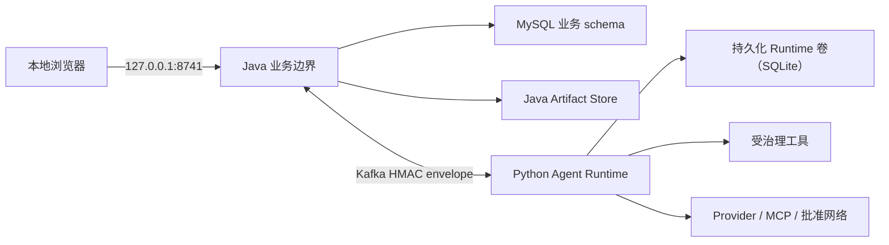

# Threat Model

## Scope

采价台是本地单用户应用，不是多租户安全边界。浏览器输入、上传文档、模型输出、工具参数、Provider、MCP 和网络内容均视为不可信。

## Assets

- 采购需求、报价、人工修正、快照、决定与审计完整性；
- 原始报价与生成的采购执行 Artifact；
- Provider 凭据、Token 与费用预算；
- Run、Session、Checkpoint、Approval 和工具结果；
- 工作区文件、宿主进程与网络访问。

## Trust zones

## Controls

| Threat | Controls |
|---|---|
| 远程浏览器访问 | Java 生产模式只接受本地 Host；非安全方法校验同源 Origin；开发模式只额外允许配置的 Vite Origin |
| 直接访问 Python | Python 端口不映射宿主机；浏览器只访问 Java，Java 与 Python 之间只经 Kafka |
| 任意反向代理 | Java 只实现显式 Runtime 路径允许列表，不接受用户提供的代理目标或任意路径 |
| 请求伪造 actor | 公共请求不接受 actor；本地采购员来自 `APP_LOCAL_OPERATOR`，Agent actor 固定为 `agent` |
| 上传炸弹或恶意文档 | 扩展名、单文件/总大小、数量、XLSX ZIP 条目/压缩比/工作表/行列、PDF 页数/字符/加密限制；扫描件拒绝 |
| Artifact 路径穿越 | 内容寻址 ID、所有者前缀、两级 SHA-256 分片、规范路径校验、临时文件加原子移动 |
| 模型修改报价或决定 | Python 无采购业务写入 Repo；人工修正和最终事务仅在 Java；模型只能经白名单命令和 Harness Approval |
| 重放或重复副作用 | Java MySQL 与 Python Runtime 分别持久化幂等键；不可变 operation ID/payload SHA、generation/version、结果与最终决定复用 |
| stale approval | pending decision 绑定 Run、工具、任务版本、快照、输入哈希、决定、报价与备注哈希；Java 最终事务重新核验 |
| Agent 中断或响应丢失 | durable outbox、有界重试、同 operation replay；非重试失败恢复任务状态；未知副作用结果保留证据并拒绝盲目重复 |
| MySQL 中途失败 | 业务状态、outbox、失效、决定和审计在对应单一事务中提交；乐观锁与最终悲观锁复核 |
| Python 宕机拖垮业务读取 | Java readiness 不依赖 Python；业务报告和已投影 Run 审计保持可读；只有实时 `/api/runtime` 可用性检查返回结构化 503 |
| Secret 泄露 | Token/凭据来自环境或 Python 本地配置；结构化脱敏后再持久化/返回；凭据 Header 不透传到公共响应 |
| SSRF / 私网访问 | 每跳 DNS/IP 与 peer 校验、默认拒绝私网目标、Provider/网络工具遵循显式治理 |
| 成本失控 | step/time/token/output/费用上限，Provider 尝试与 429/Retry-After 证据持久化 |
| 路径逃逸和宿主命令 | real-path containment、工作区根、效果分类、交互审批；路径 sandbox 不等同 OS 隔离 |

## Data lifecycle

MySQL 业务 schema 与 Java Artifact 卷保存当前采购业务；Python 的独立 Runtime 卷以 SQLite 保存 Run、Checkpoint、Lease、Approval、工具调用和内部命令幂等事实。两侧不交叉建表、不双写业务真值。历史 PostgreSQL 或旧 Runtime MySQL 数据只可离线归档，不自动导入。不得把 `.env`、数据库卷、完整日志、浏览器 profile、trace 或真实报价提交到 Git。

## Residual risks

- 获批 Shell 与工具拥有当前 OS 用户权限。
- 工作区内指向外部内容的硬链接不能由路径规范化完全识别。
- Prompt injection 仍可能诱导用户批准有害动作。
- 脱敏无法证明任意自然语言绝不含敏感信息。
- Provider 留存、计费和可用性遵循外部服务政策。
- 本地单用户边界不提供登录、RBAC、多租户或恶意本机用户隔离。

可重复的路径/审批逃逸、重复采购决定、Java/Python 双业务真值或未授权远程入口均阻断发布。

## 0.5.0 变更（Java/Python 分栈 + Kafka）

- Java→Python 命令与 Python→Java 回读只经 Kafka（RPC kind `get_task_context`/`get_artifact`/`list_events` + `caijiatai.commands`/`caijiatai.results`/`caijiatai.events`），消息带 HMAC-SHA256 签名与 `payload_sha256`/`request_sha256` 校验，防伪造/篡改/重放（幂等键防重放）。Java 侧的内部 HTTP 端点已删除；但 Python agent 进程的 `X-Agent-Internal-Token` 门禁仍在（`api/server.py` 对全部 `/internal/v1/*` 及 internal 模式下除 `/api/health` 外路径生效）：该 token HTTP 面保留为 legacy/回环兼容层，非生产通道。
- Kafka 凭据与 vhost/ACL 最小权限：正式 Compose 使用 SASL/SCRAM（`compose.kafka-sasl.yml` 覆盖）；本地 PLAINTEXT 仅限开发。
- Java 业务使用 MySQL + Flyway；Python Harness Runtime 使用独立持久化 SQLite 卷并自行管理 schema，禁止交叉建表；`.env`、密钥、数据卷不得提交。
- Web→Java 仅 `127.0.0.1:8741`；Host 校验 + 非安全方法同源校验保留；SSE 只从 Java 投影读取，不暴露 Python。
- 事件流丢失不影响业务真值：Python 持久化 + `list_events` RPC 重放；`global_seq` 唯一索引防重复投影。
