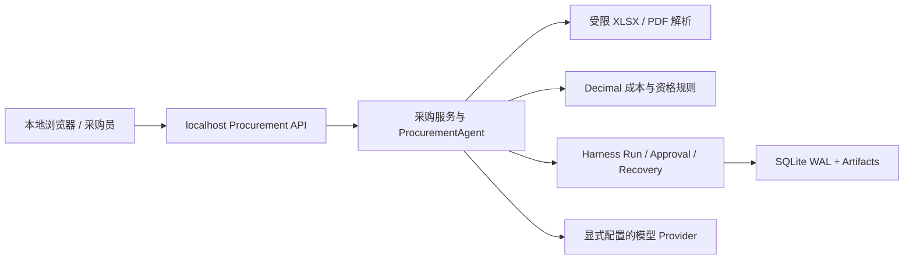

# Threat Model

## Scope

采价台是本地、单用户的采购询价与供应商比价工作台。范围包括 Web 采购入口、XLSX/PDF 报价导入、字段证据与人工修正、确定性成本/资格分析、供应商审批，以及 SQLite、Artifacts、Run/Checkpoint/Event 审计和恢复。它不是多租户安全边界。

采购文件、浏览器请求、供应商文本、模型输出和工具参数均按不可信输入处理。当前产品线不提供通用聊天、Shell、Docker、浏览器自动化、MCP、长期 Memory、网络抓取、自动下单或付款能力。

## Assets

- 采购需求、原始报价文件、抽取字段、来源摘录和人工修正；
- 成本计算、资格结果、比较快照、供应商决定和审批证据；
- SQLite 中的 Run、Checkpoint、消息、工具调用、租约、事件和 Artifact 索引；
- OpenAI 兼容 Provider 的 API Key、模型配置、Token 用量和费用上限；
- 报告完整性（`input_sha256`、`evidence_sha256`、原件 SHA-256）及本地工作区文件。

## Trust zones

## Threats and controls

| Threat | Controls |
|---|---|
| 采购请求携带越界文件或路径 | 采购上传只进入受限解析器和 Artifact Store；路径 sandbox 处理兼容运行记录，不能替代 OS 隔离 |
| 恶意 XLSX ZIP、XML 或 PDF 消耗资源 | 扩展名与 MIME 校验；5 MB 单文件/20 MB 批次限制；ZIP 条目、解压量、压缩比、工作表、行列、页数和提取字符数上限；加密、空文本和扫描件拒绝 |
| 报价文本或 Prompt Injection 改写业务事实 | 结构化 Pydantic/JSON Schema 参数；模型只调用四个采购工具；报价事实只能由后端解析或人工 correction 写入 |
| 错误金额或不合格供应商被推荐 | `Decimal` 统一单位/税费/汇率/运费；硬约束先筛选再排序；独立复算；确定性 tie-break；人工确认后才形成正式决定 |
| 未授权或重复的供应商决定 | `procurement_approve_supplier` 为 destructive effect；一次性 Approval 绑定当前快照和输入哈希；失效快照/旧审批不能提交；持久化调用状态支持结果复用 |
| API Key、报价原件或私密路径泄露 | API/事件/Artifact 摘要统一脱敏；凭据不进数据库、Run、日志或前端 GET；原件仅通过受控 Artifact ID 读取；默认 localhost |
| 进程崩溃导致状态丢失或重复执行 | SQLite WAL、事务写锁、Run lease、heartbeat、Checkpoint、追加式事件和 expiry recovery；恢复前人工复核不确定副作用 |
| Provider 超时、429 或费用失控 | 每 Run 的 step/time/token/output 上限、Provider attempt 记录、显式价格与成本预算、有限重试；Fake Provider 可离线演示 |
| 远程未认证执行 | 非回环监听默认关闭执行；显式远程开关只在外部认证代理后使用 |

## Residual risks

- 本地进程仍以当前操作系统用户权限运行；路径 sandbox 不能替代 OS、容器或虚拟机隔离，也不能消除硬链接等文件系统边界风险。
- Prompt Injection 仍可能诱导采购员批准危险或错误的业务决定；审批界面必须由人核对当前快照、金额和证据。
- 脱敏不能证明任意自然语言都不含敏感信息；Provider 的留存和计费遵循 Provider 政策。
- 恶意或格式异常的报价文件可能暴露解析器缺陷，生产部署应保持依赖更新并限制上传来源。
- `--allow-remote-execution` 不提供身份认证；没有认证代理时不得暴露到非回环网络。

修复优先级：路径/审批越界与数据泄露，其次是报价解析正确性和中断恢复，再是成本/延迟与可用性。任何可复现的未授权供应商决定或报告完整性破坏都阻塞发布。
