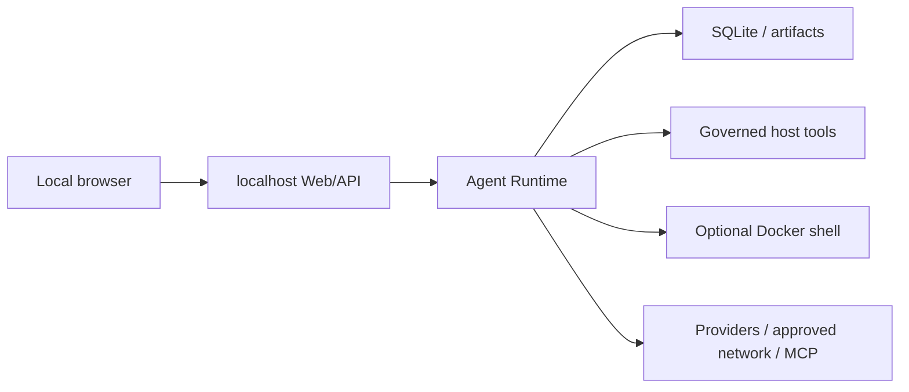

# Threat Model

## Scope

Agent Harness is a local, single-user application. It is not a multi-tenant security boundary. The browser, model output, tool arguments, fetched content, providers and MCP servers are untrusted inputs.

## Assets

- authorized workspace files;
- provider credentials and spend;
- prompts, messages, memory, checkpoints and artifacts;
- host processes and network access;
- integrity of run status and approval decisions.

## Trust zones

## Controls

| Threat | Controls |
|---|---|
| Browser selects arbitrary host paths | startup-configured workspace roots, opaque workspace ids, relative cwd only, real-path containment |
| Model path traversal or symlink escape | tool-level real-path sandbox and explicit extra roots |
| Unapproved write, command or network action | effect classification, `approval=ask`, default `allow_write=false`, Web approval broker |
| Destructive action auto-approved | destructive effects always require an interactive decision; confirmation-only actions cannot receive `allow_run` |
| Duplicate side effects after failure | durable invocation state; terminal-result reuse; safe retry/reconciliation; unknown non-idempotent outcomes require human review |
| Run stolen after process loss | lease owner, heartbeat, expiry-based recovery |
| Token or cost runaway | step/time/token/output caps, Provider attempt accounting and strict configured cost budgets |
| SSRF or private-network access | per-hop DNS/IP validation, private target denial, peer validation and browser request interception |
| Secret disclosure | structured redaction before persistence/public API, credential-header stripping and artifact redaction |
| Remote unauthenticated execution | loopback default; non-loopback bind disables execution unless explicitly overridden |
| Shutdown leaves live work | supervisor interrupts and cancels owned tasks before Harness closes resources |

## Residual risks

- Local Shell has the OS privileges of the current user after approval.
- Path containment cannot detect a hardlink inside a workspace that points to external file content.
- Prompt injection can still persuade a user to approve a harmful action.
- Redaction cannot prove arbitrary natural-language content is non-sensitive.
- Provider retention and billing follow provider policy.
- Docker, browser engines and MCP implementations are external dependencies.
- `--allow-remote-execution` does not add authentication; an authenticating proxy is mandatory.

Fix priority is safety, correctness, interruption recovery, tool reliability, cost/latency, then usability. A known path/approval escape or repeatable side effect blocks release.
